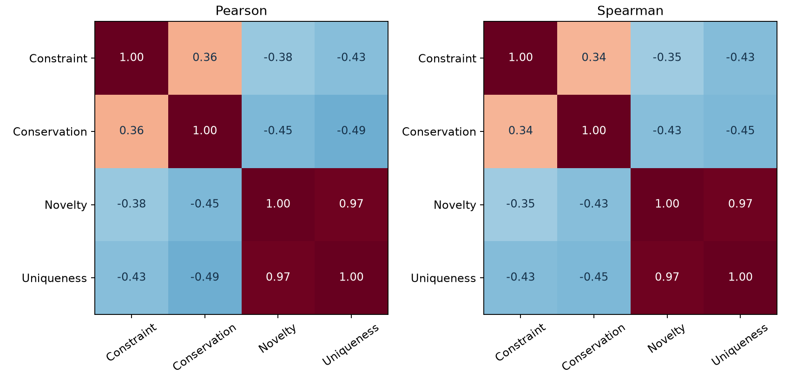
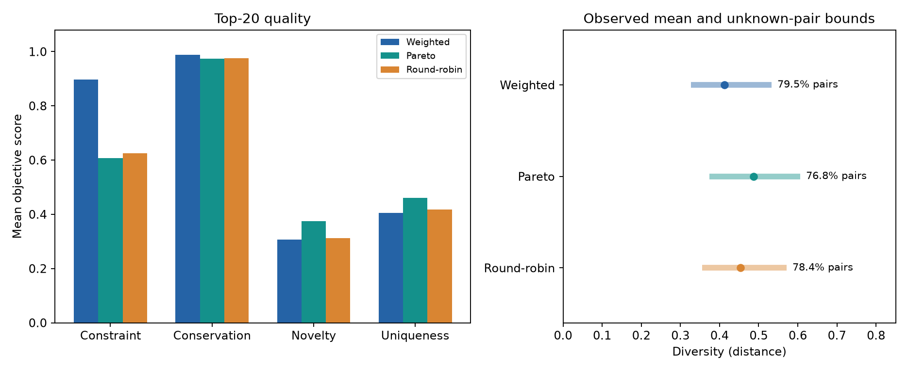
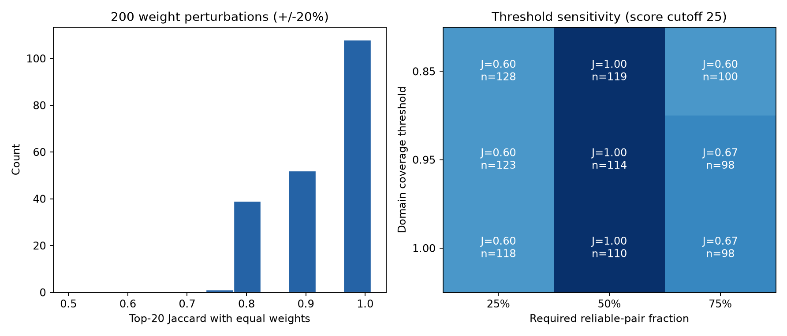

# GvpA 多目标评价与筛选

对气囊蛋白 GvpA 的候选氨基酸序列进行质量审计、四维评价和多目标筛选。项目在相同候选池与筛选预算下比较加权评分、Pareto 非支配排序和分维度轮转，输出候选名单、实验结果及可复现报告。

项目回答一个实际问题：**如何在保留家族特征、探索新序列和减少候选重复之间取舍，选出有限数量的候选用于后续验证？** 当前发布批次包含 1,000 条生成序列、114 条可排名序列，完成四项必做实验和两项选做实验。加权筛选更偏向约束支持，Pareto 筛选保留更高的新颖性；名单对小幅权重变化较稳定，对可靠配对比例门槛更敏感。

**阅读入口：** [从零理解项目](docs/PROJECT_GUIDE.md) · [实验报告](reports/PROJECT_REPORT.md) · [中期材料](reports/midterm/README.md) · [方法定义](docs/METHODS.md) · [复现说明](docs/REPRODUCIBILITY.md)

**本页导航：** [评价指标](#metrics) · [快速运行](#run) · [数据与筛选结果](#results) · [逐项实验与图表](#experiments) · [目录说明](#directories) · [适用范围](#scope)

## 项目能力

- 审计候选来源、序列质量、家族归属、结构域支持及人工复核标记。
- 计算约束满足度、保守性、新颖性和候选独特性，并保留未解析的距离。
- 在固定预算下生成三种策略的 Top-10、Top-20、Top-50 名单及 FASTA。
- 分析指标关系、策略差异、逐维消融、权重与门槛敏感性。
- 比较同池随机筛选，解释 Pareto 前沿的序列特征及长度匹配敏感性。
- 校验冻结输入与输出哈希，保留版本、配置和逐候选证据。

```text
参考序列与生成候选
       ↓
质量控制、家族判定、结构域证据
       ↓
全局序列比对与四维评分
       ↓
证据充分性检查 → 三策略筛选
       ↓
相关性、消融、敏感性、随机对照、前沿特征分析
       ↓
候选名单、审计表、图表与报告
```

<a id="metrics"></a>

## 四个评价目标

四维分数均在 `[0,1]` 内，方向为越高越好，但分数不代表功能成功概率。

| 目标 | 回答的问题 | 实际计算方式 |
| --- | --- | --- |
| 约束满足度（Constraint） | 候选有多强的气囊蛋白结构域支持？ | PF00741 域分数在参考分布中的经验百分位，结合模型覆盖因子 |
| 保守性（Conservation） | 关键参考位点是否保留？ | 固定参考多序列比对中 23 个统计保守位点的共识一致比例 |
| 新颖性（Novelty） | 与已有天然序列有多不同？ | 到最近可靠天然参考的全局序列距离 |
| 候选独特性（Uniqueness） | 与这批其他候选有多不同？ | 到 136 条联合合格序列中其他条目的已解析距离均值 |

距离使用 `1 − 一致残基数 / 两条原始序列中较长者的长度`，并先检查比对可靠性。低质量或覆盖不足的比对保留为未知值。**候选独特性用于逐条排序；集合多样性另行衡量入选集合内部的两两距离。**后者同时报告配对覆盖率和未知距离造成的均值上下界，避免把无法可靠比对误认为更加多样。

<a id="run"></a>

## 快速运行

使用 **Python 3.12 和 Git**。评价与前沿分析使用 CPU，不需要 GPU 或生成模型权重。请完整克隆仓库，冻结入口需要读取 Git 历史中的原始输入。

```bash
git clone https://github.com/Jiejiezi-jie/ML-GV02-03.git
cd ML-GV02-03
python -m venv .venv
```

激活环境：

```powershell
# Windows PowerShell
.venv\Scripts\Activate.ps1
```

```bash
# Linux / macOS
source .venv/bin/activate
```

安装依赖并运行两个实验入口：

```bash
python -m pip install -r requirements-frozen-v2.txt
# 必做 1–4 和选做 7
python experiments/run_full_experiment.py --output results/reproductions/evaluation
# 选做 6
python experiments/run_pareto_analysis.py --output results/reproductions/pareto_analysis
```

- 第一个入口核验冻结输入，重算评价、筛选、消融、鲁棒性和随机对照，并独立重复检查 44 个输出。
- 第二个入口从已发布的同批次评价结果重算前沿、特征及匹配分析，生成 24 个输出；它不会自动改用上一条命令的临时输出。
- 每次运行使用新的或空目录；产物默认不覆盖已发布结果。下载 ZIP 或缺少源提交的浅克隆不能代替完整克隆。

生成报告：

```bash
python experiments/build_project_report.py --output results/reproductions/report
```

报告生成入口读取并核验已发布评价和前沿分析结果。QC、全局比对的扩展复现、测试与自定义输入详见[复现说明](docs/REPRODUCIBILITY.md)。

最近一次计算验收（2026-10-07）在独立 Git 副本中通过 **333 项测试**。主评价 44 个产物中，42 个与发布版本字节一致，2 张图仅有渲染字节差异，数值、名单和行序一致；前沿分析的 24 个产物及清单逐字节一致。记录见[交付验收](results/validation/delivery_20261007/README.md)，其中的文档哈希保留该次验收的快照，后续 README 编辑以 Git 提交记录为准。

<a id="results"></a>

## 数据与筛选结果

发布批次采用固定种子 42，保守天然参考包含 346 条序列，按同源簇拆分为 277/33/36 条训练、验证、测试序列。评价使用已冻结的生成候选，不依赖重新训练生成器。

| 阶段 | 候选数 | 说明 |
| --- | ---: | --- |
| 生成 / 基础质量检查通过 | 1,000 / 1,000 | 通过基础格式与序列检查，随后继续核验家族和结构域 |
| GvpA 家族支持 | 147 | 另外 47 条家族歧义、806 条排除；PF00741 命中不能独立证明 GvpA 身份 |
| 质量、家族、结构域联合门槛通过 | 136 | PF00741 域分数 ≥25 bits、模型覆盖 ≥0.95 |
| 四维证据充分，进入排名 | 114 | 22 条评分证据不足，保留审计记录；排名要求至少 50% 的候选配对可靠 |
| 第一 Pareto 前沿 | 10 | 四维上不被同池其他候选支配；全池共有 13 个非支配层 |

最终逐条分数见 [ranking_pool_scores.tsv](results/gv02_03_v2/d_evaluation_member_a_v1/ranking_pool_scores.tsv)，全部生成候选的去向见 [candidate_audit.tsv](results/gv02_03_v2/d_evaluation_member_a_v1/candidate_audit.tsv)。

<a id="experiments"></a>

## 实验一览与图表解读

以下编号对应 GV02-03 原始任务，基础评价 pipeline 支撑各项实验。选做项目最多两项，本项目选择 **6 和 7**。

| 实验 | 状态 | 方法与比较对象 | 核心结果 |
| --- | --- | --- | --- |
| [1：目标相关性与冲突](#experiment-1) | 必做，已完成 | Pearson、Spearman、散点矩阵 | 保守性与独特性冲突最强；新颖性与独特性高度相关 |
| [2：三种筛选策略](#experiment-2) | 必做，已完成 | 同池比较加权、Pareto、轮转，K=10/20/50 | 加权约束支持更高；Pareto 新颖性更高；名单明显不同 |
| [3：逐维消融](#experiment-3) | 必做，已完成 | 保持硬门槛，逐一移除排序目标 | 移除约束分后 Top-20 变化最大，Jaccard=0.3333 |
| [4：参数鲁棒性](#experiment-4) | 必做，已完成 | 200 次权重扰动、27 组门槛组合 | 权重扰动 Jaccard 均值 0.9385；门槛扰动最低 0.6000 |
| 5：下游验证代理 | 未选、未做 | 未接入下游性质预测模型 | 域检查和跨膜扫描不计为该选做实验 |
| [6：Pareto 前沿分析](#experiment-6) | 选做，已完成 | 10 条前沿对 104 条非前沿，长度匹配、组成分析 | 前沿较长；组成更分散的方向在所检查匹配中稳定，G/P 差异不稳定 |
| [7：随机筛选对照](#experiment-7) | 选做，已完成 | 同池、同 Top-20 预算，1,000 次随机抽样 | 三策略提高新颖性，但并非每个指标都优于随机 |

图中英文指标对应上文四个目标。除特别说明外，策略结果均为同一批次的 Top-20 均值。

<a id="experiment-1"></a>

### 实验 1：四个目标是否相互冲突？

**做法：**在 114 条可排名候选上计算 Pearson 线性相关系数和 Spearman 排名相关系数，并绘制四维散点矩阵。系数为负表示两个分数倾向于反向变化，为正表示倾向于同向变化。



**结果与解释：**

- 保守性与候选独特性的负相关最强：Pearson **−0.4885**、Spearman **−0.4474**。更像参考保守位点的候选，往往与其他候选更相似。
- 新颖性与独特性高度正相关：Pearson **0.9749**、Spearman **0.9694**。远离天然参考的候选通常也远离当前候选池，两个目标在本批次有较强重叠。
- 因此需要比较目标取舍，不能仅挑一个指标最高的序列。相关关系只针对筛选后的当前候选池，不代表因果关系或所有天然蛋白的规律。

证据：[Pearson 表](results/gv02_03_v2/d_evaluation_member_a_v1/correlation_pearson.tsv) · [Spearman 表](results/gv02_03_v2/d_evaluation_member_a_v1/correlation_spearman.tsv) · [散点矩阵](reports/figures/metric_scatter_matrix.png)

<a id="experiment-2"></a>

### 实验 2：三种策略分别选出了什么？

**做法：**固定 114 条候选和相同筛选预算，比较三种方法，分别输出 Top-10、Top-20、Top-50，共九份名单。

- **等权加权**：四维各占 0.25，按总分排序。
- **Pareto**：先按非支配层排序，再用拥挤距离区分同层候选，保留不同目标组合。
- **分维度轮转**：轮流从四个单维排名中选取尚未入选的候选。

| 策略 | 约束满足度 | 保守性 | 新颖性 | 候选独特性 | Top-20 中第一前沿成员数 |
| --- | ---: | ---: | ---: | ---: | ---: |
| 等权加权 | **0.8967** | **0.9891** | 0.3073 | 0.4051 | 4 |
| Pareto | 0.6070 | 0.9739 | **0.3751** | **0.4601** | 10 |
| 分维度轮转 | 0.6254 | 0.9761 | 0.3121 | 0.4179 | 9 |



**如何读图：**左图比较四维均值；右图圆点为已解析配对的平均距离，横线表示把未知距离限制在 `[0,1]` 时，全部配对均值的可能范围，**不是置信区间**。三种策略的可靠配对覆盖率依次为 79.5%、76.8%、78.4%。

**结果说明：**加权名单适合优先考察域约束支持较强的候选；Pareto 适合探索新颖性与约束之间的取舍；轮转覆盖各单维高分候选。加权与 Pareto 的 Top-20 名单 Jaccard 为 **0.3333**，即共同入选 10 条，策略选择确实会改变交付名单。Pareto 的已解析对多样性均值较高，但未知距离范围重叠，不能断言其完整集合多样性严格更高。

证据：[策略汇总](results/gv02_03_v2/d_evaluation_member_a_v1/strategy_summary.tsv) · [名单重叠](results/gv02_03_v2/d_evaluation_member_a_v1/strategy_overlap.tsv) · [各预算前沿人数](reports/pareto_front_summary.tsv)

<a id="experiment-3"></a>

### 实验 3：每个目标对最终名单有多大影响？

**做法：**以四维等权 Top-20 为基准，每次移除一个排序目标，再对剩余目标等权评分；质量、家族和结构域硬门槛保持不变。用 Jaccard 比较名单，定义为 `交集人数 / 并集人数`，1 表示名单完全相同。

| 移除的排序目标 | 与完整模型的名单 Jaccard | 剩余名单的约束均值 | 新颖性均值 |
| --- | ---: | ---: | ---: |
| 不移除（基准） | 1.0000 | 0.8967 | 0.3073 |
| 约束满足度 | **0.3333** | 0.6033 | 0.3778 |
| 保守性 | 0.9048 | 0.8676 | 0.3245 |
| 新颖性 | 0.4815 | 0.9619 | 0.2329 |
| 候选独特性 | 0.6667 | 0.9344 | 0.2754 |

**结果说明：**约束分对本批次名单影响最大；删除新颖性后，名单更偏向约束分，但探索程度下降。保守性的消融影响较小，与筛选后候选的保守性普遍较高有关，不能据此删除其他数据上的保守性检查。新颖性与独特性虽高度相关，移除任一项仍会改变排名取舍。

证据：[消融统计](results/gv02_03_v2/d_evaluation_member_a_v1/ablation_summary.tsv) · [消融名单](results/gv02_03_v2/d_evaluation_member_a_v1/ablation_selections.json)

<a id="experiment-4"></a>

### 实验 4：调整权重或门槛，名单会不会大变？

**做法：**进行两类扰动，均与默认加权 Top-20 比较。

1. **权重扰动**：四个基准权重各自随机变化 ±20%，重新归一化，重复 200 次。
2. **门槛扰动**：域分数阈值乘以 0.8/1.0/1.2，域覆盖门槛偏移 −0.1/0/+0.1（最高截断为 1），可靠配对要求设为 25%/50%/75%，共 27 组。



**如何读图：**左图是 200 次权重扰动后的名单相似度；右图展示域分数门槛固定为 25 bits 的 9 组组合，`J` 为名单 Jaccard，`n` 为可排名人数。全部 27 组均保存在数据表中。

| 扰动 | 结果 | 说明 |
| --- | --- | --- |
| 权重 | Jaccard 均值 **0.9385**，范围 0.7391–1.0000；全池排序 Spearman 均值 0.9925 | 默认权重附近的小幅变化通常只改变少量候选 |
| 门槛 | Jaccard **0.6000–1.0000**；可排名候选 **98–128 条** | 候选资格和参照池变化会传导到评分与名单 |

固定 50% 可靠配对要求时，本次所有域分数和域覆盖扰动都保持 Top-20 名单不变；改为 25% 或 75% 时名单明显变化。**因此，当前更需要说明可靠配对门槛及其影响，不能只报告一组权重下的最优名单。**稳定性结论仅覆盖实际检查的扰动范围。

证据：[权重扰动](results/gv02_03_v2/d_evaluation_member_a_v1/weight_robustness.tsv) · [门槛结果](results/gv02_03_v2/d_evaluation_member_a_v1/threshold_coverage_sensitivity.tsv)

<a id="experiment-6"></a>

### 实验 6：Pareto 前沿体现什么取舍，有什么共同特征？

**做法：**解释全部 10 条第一前沿候选的四维优势，再与 104 条非前沿候选比较六项预定特征：长度、氨基酸组成熵、最高单一残基比例、DEKR 比例、G/P 比例、最长同聚物段。另报告完整 20 种氨基酸组成，并选取 10 条非前沿序列做一对一长度匹配。


**如何读图：**上图每条线是一条序列，绿色为第一前沿，灰色为其他候选；下图数字为原始分数，颜色为同池排名百分位。候选 `000959` 的约束分为 **1.0000**；候选 `000061` 的新颖性为 **0.5818**、独特性为 **0.6248**，但约束分只有 **0.2787**。前沿保留了不同取舍，没有一条序列在四个目标上同时最好。


**如何读图：**每点为一条序列，横线为中位数、竖线为四分位距。Front 是 10 条前沿，Rest 是 104 条非前沿，Matched 是从 Rest 中选出的 10 条长度匹配对照；Matched 不是独立的第三批样本。

| 比较 | 观察结果 | 可以说明什么 |
| --- | --- | --- |
| 序列长度 | 前沿均值 **103.1**，非前沿 **94.33** 个残基 | 原始组间特征差可能受到长度影响，需要匹配对照 |
| 长度匹配后的组成 | 组成熵均值差 **+0.04938 bits**；最高单一残基比例差 **−1.170 个百分点** | 当前前沿的氨基酸组成较分散，这一描述在该匹配下仍保留 |
| G/P 比例 | 均值差由匹配前 **+1.854** 变为匹配后 **−0.053 个百分点** | 较高 G/P 比例并非稳健的前沿共同特征 |
| 100 组等价最优匹配 | 熵差均为正、最高残基占比差均为负；G/P 差 60 组为负、40 组为正 | 前两项方向在所检查对照中稳定，G/P 结论依赖对照选择 |

差值统一为“前沿减对照”。100 组匹配都保持同一个最小总长度差，属于对照选择敏感性检查，不是独立实验重复或显著性检验。上述组成特征也不能替代结构、表达或功能验证。

证据：[实验 6 完整报告](results/gv02_03_v2/pareto_analysis_member_a_v1/EXPERIMENT_6_REPORT.md) · [逐候选解释](results/gv02_03_v2/pareto_analysis_member_a_v1/front_details.tsv) · [特征比较](results/gv02_03_v2/pareto_analysis_member_a_v1/group_comparison.tsv) · [匹配敏感性](results/gv02_03_v2/pareto_analysis_member_a_v1/tie_match_summary.tsv)

<a id="experiment-7"></a>

### 实验 7：这些策略比随机挑选好在哪里？

**做法：**从同一 114 条候选池无放回随机抽取 20 条，重复 **1,000 次**，比较三策略与随机基线的四维均值、集合多样性及可靠配对覆盖率。下表列出关键指标，完整表保留全部比较。

| 指标 | 随机抽样均值 | 等权加权 | Pareto | 分维度轮转 |
| --- | ---: | ---: | ---: | ---: |
| 约束满足度 | 0.6811 | **0.8967** | 0.6070 | 0.6254 |
| 新颖性 | 0.2126 | 0.3073 | **0.3751** | 0.3121 |
| 集合多样性下界 | 0.3188 | 0.3276 | **0.3745** | 0.3555 |
| 可靠配对覆盖率 | **92.35%** | 79.47% | 76.84% | 78.42% |

**结果说明：**三种策略都提高了本批次的新颖性和候选独特性；加权策略同时提高约束均值，Pareto 和轮转的约束均值则低于随机。策略名单更偏向探索，但配对证据覆盖也更低，所以不能概括为“每个方面都优于随机”。

随机新颖性不低于策略值的加一修正经验比例，三策略均为 **0.0010**；多样性下界对应比例依次为 **0.3457、0.0060、0.0519**。这些数字只描述固定候选池上的随机抽样对照，未做多重比较校正，不能当作生物学功能显著改善的证据。多样性下界由未知距离取 0 计算，不代表全部配对真实均值已知。

证据：[逐次随机抽样](results/gv02_03_v2/d_evaluation_member_a_v1/random_baseline.tsv) · [策略与随机对比](results/gv02_03_v2/d_evaluation_member_a_v1/random_comparison.tsv)

### 如何根据结果选择名单

- **重视域约束支持、验证预算有限**：先查看加权名单，再逐条检查复核标记。
- **希望探索更多目标取舍**：查看 Pareto 前沿及其四维证据，关注新颖性提升伴随的约束下降和未知距离。
- **希望覆盖各单维高分候选**：查看分维度轮转名单，同时检查集合质量与配对覆盖。

三种策略都保留审计信息；第一前沿或高分本身不构成实验功能确认。

<a id="directories"></a>

## 项目目录：每个目录做什么

### 顶层目录与配置文件

| 目录 / 文件 | 存放内容 | 什么时候查看 |
| --- | --- | --- |
| [configs/](configs/) | 候选生成、家族判定、QC、相似度和最终评价参数；`d_evaluation.json` 固定主评价源提交、阈值和种子 | 查默认参数或开发新实验配置 |
| [data/](data/README.md) | 原始参考、生成序列、清洗与分池、划分和逐条输入证据 | 追踪某条序列从哪里来、为何保留或排除 |
| [preprocessing/](preprocessing/) | FASTA 输入审计脚本 `audit_fasta.py` | 检查原始序列格式与基础统计 |
| [models/](models/) | 家族 HMM、Pfam 模型、种子比对，以及 VAE 训练日志和清单 | 核查家族 / 域模型与生成记录；原始 VAE 权重缺失 |
| [src/gv_eval/](src/gv_eval/) | 核心 Python 实现：比对、评分、筛选、质量审计、前沿特征与生成扩展 | 理解算法；主评价见 `d_evaluation.py`，实验 6 见 `pareto_features.py` |
| [experiments/](experiments/) | 可执行的实验、复现、数据准备及报告脚本 | 按上方命令运行，通常从这里调用代码 |
| [results/](results/README.md) | 正式机器可读结果、九份候选名单、扫描证据、复现验收记录 | 获取实际候选或核对报告中的数值 |
| [reports/](reports/) | 正式项目报告、汇总统计、报告图表和中期材料 | 阅读完整实验论证，取用展示图表 |
| [docs/](docs/) | 教程、方法定义、复现步骤、实验 6 方案和课程要求原件 | 从头学习、查询指标定义或核对要求 |
| [references/](references/README.md) | 数据库来源快照、家族来源说明和标签争议复核依据 | 核查参考序列与模型的来源和处理理由 |
| [tests/](tests/) | 算法行为、数据完整性、候选资格、复现和端到端检查 | 修改代码后做回归验证 |
| [requirements-frozen-v2.txt](requirements-frozen-v2.txt) | 主评价、前沿分析和报告生成的固定版本依赖 | 安装上方最小运行环境 |
| [requirements-integration.txt](requirements-integration.txt) | 扩展 QC、全局比对与集成验证依赖 | 使用扩展复现入口；VAE 测试另需 PyTorch |
| [environment.yml](environment.yml) | Linux/WSL 生信工具环境描述，包含 HMMER、MAFFT、BLAST+、CD-HIT | 重建外部家族证据时参考；主评价采用上方 Python 3.12 环境 |
| [.gitattributes](.gitattributes) / [.gitignore](.gitignore) | 发布证据的字节 / 行尾规则，缓存与本地复跑输出忽略规则 | 排查跨平台哈希差异或提交范围 |

### 关键子目录

```text
data/
├── raw/                                  原始天然序列与经审阅参考
├── candidates/t05/                       家族判定仍依赖的历史输入序列
├── generated/sequence_vae/               当前 1,000 条候选及采样元数据
└── processed/gv02_03_v2/
    ├── reference/                       参考家族分类、种子及负对照
    ├── member_b_handoff/                346 条保守参考及发布清单
    │   └── development_split/           同源簇隔离的训练 / 验证 / 测试划分
    └── vae_member_a_v1/                 候选 QC、分池、位点与初始评分证据
models/
├── family_profiles/                     参考家族 HMM、种子和比对
├── family_profiles_vae_member_a_v1/      生成候选家族判定使用的模型证据
├── pfam/                                PF00741 模型及元数据
└── generator/sequence_vae/              训练曲线、训练日志与清单
results/
├── gv02_03_v2/
│   ├── d_evaluation_member_a_v1/        正式主结果：必做 1–4、选做 7
│   ├── pareto_analysis_member_a_v1/     正式前沿分析：选做 6
│   ├── family/                          天然参考的家族校准与复核
│   └── vae_member_a_v1/                候选家族分类和初始评分证据
├── gv02_03_c_handoff_member_a_v1/        QC、参考全局距离、同池距离及预警
├── gv02_03_c_domains_member_a_v1/        Pfam 结构域扫描证据
├── gv02_03_c_tm_member_a_v1/             跨膜扫描证据
├── gv02_03_c_final_handoff_member_a_v1/  域、跨膜和序列质量的统一审计
└── validation/                          按实际运行范围保存的验收记录
reports/
├── PROJECT_REPORT.md                    正式报告：研究问题、方法、结果、局限
├── figures/                             本 README 使用的主实验图
└── midterm/                             原版中期 PPT、逐页讲稿和已有概览
docs/
├── PROJECT_GUIDE.md                     18 章学习教程与逐实验解释
├── METHODS.md                          公式、规则与实现位置
├── REPRODUCIBILITY.md                   环境、命令、复现边界与历史版本
├── EXPERIMENT_6_PROTOCOL.md             前沿特征分析方案
├── COURSE_REQUIREMENTS.md              原始要求与交付对应表
└── course/                             课程题目、评分和过程要求原件
references/conflict_review/              标签争议的来源响应与人工复核依据
```

`member_a_v1`、`member_b_handoff` 等是已冻结的路径标识，保留它们用于匹配历史输入与哈希清单。**最终分数以 `d_evaluation_member_a_v1/` 为准**；其他证据目录用于追踪来源，不应混用其中的初始评分作为最终结果。

本地运行会创建 `results/reproductions/`，它是 Git 忽略的临时输出目录，初次克隆时可以不存在。

### 想拿结果时，直接找哪些文件？

主结果目录：[results/gv02_03_v2/d_evaluation_member_a_v1/](results/gv02_03_v2/d_evaluation_member_a_v1/)。

| 文件 | 用途 |
| --- | --- |
| `candidate_audit.tsv` | 全部 1,000 条候选的资格、去向及审计信息 |
| `ranking_pool_scores.tsv` / `ranking_pool.fasta` | 最终 114 条可排名候选的四维分数与序列 |
| `weighted_sum_top20.tsv` / `.fasta` | 默认加权 Top-20 的逐条分数及序列 |
| `pareto_top20.tsv` / `.fasta` | Pareto Top-20；同目录有 Top-10、Top-50 |
| `dimension_round_robin_top20.tsv` / `.fasta` | 分维度轮转 Top-20；同目录有其他预算 |
| `strategy_summary.tsv` / `strategy_overlap.tsv` | 各策略的质量、多样性和名单重叠 |
| `ablation_summary.tsv` / `weight_robustness.tsv` / `threshold_coverage_sensitivity.tsv` | 消融、权重扰动和门槛敏感性 |
| `random_baseline.tsv` / `random_comparison.tsv` | 随机基线及策略对比 |
| `manifest.json` | 输入 / 输出哈希、配置、环境和来源信息 |

选做 6 的逐候选解释、特征与匹配表位于 [pareto_analysis_member_a_v1/](results/gv02_03_v2/pareto_analysis_member_a_v1/)，文件索引见 [results/README.md](results/README.md)。

<a id="scope"></a>

## 适用范围

本项目完成 GV02-03 的四项必做实验，并选择实验 6（Pareto 前沿分析）与实验 7（随机筛选对照）作为两项选做。实验 5 的下游性质预测未实现。结题答辩 PPT 尚未制作，已有中期材料按原版本保留。

结果用于候选排序和后续验证规划。参考集仍为暂定版本，尚无表达、结构、组装或功能实验确认。未知距离保留为缺失值；集合多样性同时报告配对覆盖率及上下界，不能仅凭已解析对均值判断整体优劣。

GRU-VAE 训练与生成代码作为扩展保留。原始权重未交付，原训练与采样尚不能重放；冻结候选的评价和筛选不依赖该权重。完整家族建模、Pfam 和 PureseqTM 重扫需要额外工具及数据库，现有复现流程会明确区分重新计算与已有证据核验。
