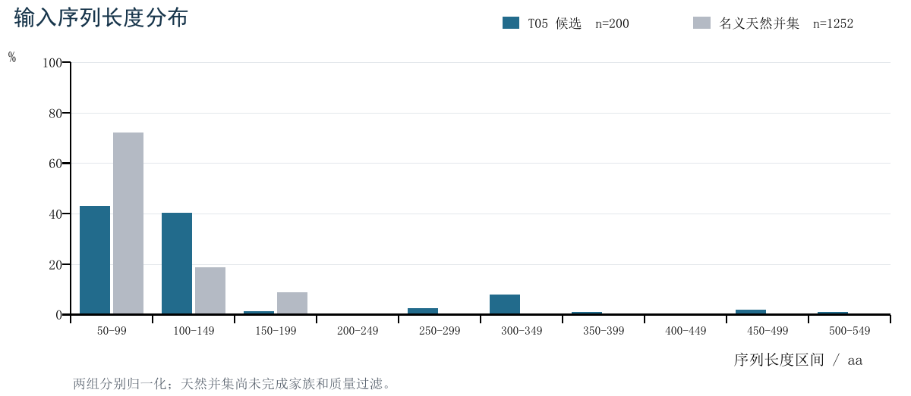

# GvpA 候选序列多目标评价
# 功能需求分析与任务建模报告

课程：机器学习综合实践　项目：GV02-03　阶段：M1 问题分析　日期：2026-09-11

本项目以教师提供的 T05 生成序列为候选入口，建立约束满足度、保守性、新颖性、多样性四维评价体系，在相同候选池和相同选样数量下比较筛选策略，并分析指标、权重和阈值变化对结果的影响。核心交付是可复现的评价与筛选工具、实验分析及候选名单。本阶段完成任务定义、输入数据审计和实施方案；四维正式评分及策略实验将在后续阶段开展。[1，第20–22页]

## 1 背景与项目定位

### 1.1 为什么需要候选评价

气囊是由蛋白质构成的纳米空腔结构，GvpA 是主壳体蛋白。气囊的形成还涉及其他 Gvp 蛋白及基因调控，因此单条序列的计算评分只能提供进入下游验证的优先级，不能证明气囊已经形成或功能已经实现。[1，第5页]

生成模型可以输出大量氨基酸序列，但“能够生成”不等于“值得验证”。与天然序列极其相近的候选可能缺乏新颖性；差异很大的候选可能破坏保守特征；单条得分较高的候选汇成一组后也可能高度趋同。我们的研究对象是这些目标之间的取舍及筛选决策的稳定性。

### 1.2 Track 1 的完整任务关系

Track 1 共12个子项目，形成蛋白识别、序列设计、基因线路三个层次。以下列出各项目与本任务的接口，而非将全部项目纳入实施范围。[1，第5–37页]

| 项目 | 主要研究内容 | 与 GV02-03 的关系 |
| --- | --- | --- |
| GV01-01 | Gvp 类型识别与跨物种泛化 | 已有类型证据可辅助输入核验 |
| GV01-02 | 序列模式与表示分析 | 可提供保守 motif、MSA 和参考位点 |
| GV01-03 | GvpA 功能预测与位点归因 | 可提供关键位点证据 |
| GV02-01 | 蓝藻 GvpA 序列生成 | 指南指定的上游候选来源之一 |
| GV02-02 | 性质预测与设计反馈 | 可选的下游性质验证代理 |
| GV02-03 | 多目标候选评价 | 本项目：评分、筛选、对比、鲁棒性 |
| GV02-04 | 定向序列优化 | 可调用本项目评价器评估修改后的序列 |
| GV02-05 | 跨物种序列生成 | 潜在候选来源，不要求我们实现 |
| GV02-06 | 主动学习迭代设计 | 可将本项目评价器接入迭代流程 |
| GV03-01 | 启动子强度预测与迁移 | DNA 调控层面，超出当前范围 |
| GV03-02 | 操纵子调控模式发现 | 基因线路层面，超出当前范围 |
| GV03-03 | 多基因协同表达优化 | 系统层面，超出当前范围 |

我们接收上游候选及天然参考，输出四维证据和筛选子集。指南明确“不训练新模型”；本项目不承担生成模型训练、性质预测器训练、完整结构预测工程、序列定向改写或基因线路优化。[1，第20页]

<!-- pagebreak -->

## 2 数据来源与已完成的特点分析

### 2.1 当前输入资产

当前保留6个 FASTA 文件。下表中的“唯一”仅指完整序列精确去重，不代表按相似度聚类，也不代表家族或功能已验证。统计由 `preprocessing/analyze_inputs.py` 生成，完整结果见 `results/input_audit/summary.json`。[2]

| 数据及当前位置 | 记录数 | 唯一序列数 | 长度范围 aa | 项目用途 |
| --- | ---: | ---: | ---: | --- |
| candidates/t05/generated_gvp.fasta | 200 | 200 | 66–512 | 唯一生成候选入口 |
| raw/t05/gvpa/GvpA_NotPartial.fasta | 2000 | 1196 | 61–160 | 天然参考来源 |
| raw/t05/gvpa/GvpA_RefSeq.fasta | 862 | 862 | 54–177 | 天然参考来源 |
| raw/t05/gvpa/rescued_GvpA_candidates.fasta | 2 | 2 | 73–83 | 天然补救来源，非生成候选 |
| raw/design/GvpA.fasta | 856 | 856 | 60–100 | 补充天然参考来源 |
| raw/t05/real_gvp.fasta | 4379 | 4379 | 54–757 | 混合家族背景与上游数据来源 |

表内路径均相对于 `data/`。四份名义 GvpA 来源的并集为1252条不同序列，尚未过滤。design 来源独有30条、NotPartial 来源独有354条、RefSeq 来源独有9条、rescued 来源独有1条。design 独有条目中仅3条标注 GvpA，另有25条 GvpJ 和2条未明确；独有数量不等于新增可信 GvpA 数量。

### 2.2 T05 候选的实际特点

200条候选均由标准20种氨基酸组成，无空序列、重复 ID 或完全相同的序列。平均长度138.93 aa，中位数103 aa，第一与第三四分位数分别为93和114 aa。均值高于中位数，提示长序列尾部对分布的影响。两条恰好达到生成脚本的512长度上限，应标记为可能受上限影响，尚不能断言发生截断。[2]

候选与4379条混合真实序列、1252条名义 GvpA 并集均无完整序列完全相同。这仅排除了整条照搬，不能据此判断高新颖性：高度相似但不完全相同的序列仍需比对。

候选头信息为 `gen_0` 等生成编号，缺乏家族、物种与实验标签。T05 原任务混合多种 Gvp 家族，因此这200条是待审计的生成池，当前尚无已确认的纯 GvpA 生成子集。[3]

### 2.3 天然参考的质量问题

design 文件的头信息中有824条 GvpA、30条 GvpJ 和2条未明确上述家族的记录，另有19条含 partial 注释。NotPartial 文件存在804条精确重复记录，且部分含未知残基 X；混合真实序列也含 X。文件名和已有标签只能作为来源线索，不能替代核验。

已有来源材料没有提供可信的功能实验标签、完整的候选家族分配、可直接采用的 GvpA 参考 MSA 或已验证关键位点。原 design 的 MSA 是截短至相同长度，已删除。统计上高保守的列与实验验证的功能关键位点需在报告中区分。

<!-- pagebreak -->

## 3 数据使用方案与实施前核验



图1　T05候选与四份名义 GvpA 来源精确去重并集的长度分布。两组分别归一化，参考并集尚未做家族及质量过滤。图中差异说明需要输入核验，不能仅凭长度判断家族或序列功能。

### 3.1 三类数据分别使用

候选池保留 T05 的全部200条原始序列及来源编号。天然参考清洗后用于保守性和新颖性计算；为避免大量近重复条目支配列频率，MSA 可使用聚类代表或序列权重，而新颖性检索库应保留覆盖更完整的天然序列。4379条混合真实序列用于来源分析和其他 Gvp 类型的比对背景，不能直接充当纯 GvpA 的保守性参考。

基础质控先检查格式、字符和重复，并记录原因。家族归属证据另行记录为支持 GvpA、支持其他类型或待核验。具有 GvpA 来源证据但域约束不通过的候选仍是评价对象，不能静默移除。所有格式有效候选先做整体审计，再明确主研究池及补充分析池，冻结名单和配置后比较策略。

若 T05 中支持 GvpA 的候选不足，优先补充 GV02-01 的已有生成结果；备选是找回 T05 缺失依赖后用已有权重采样。新增批次须单独记录来源，不能通过反复挑选高分样本构造一个预先筛优的评价池。此次不进行模型重训或候选扩充。

### 3.2 必须纠正的域编号

指南背景和相邻项目多处写 `PF01132`。官方 NCBI Pfam 记录中，PF01132 对应延伸因子 EF-P 的 OB domain；气囊蛋白家族为 PF00741 / Gas_vesicle，且包含 GvpJ。[4][5] 因此本项目将 PF00741 作为待锁定版本的气囊蛋白域资源，不能把 PF01132 直接写入扫描配置，也不能将 PF00741 命中当作 GvpA 专一标签。

上述 NCBI 页面是保存的 Pfam 模型记录，并注明不属于当前 CDD release。它们用于编号核验；正式实施应记录实际下载的 Pfam profile 版本、校验值和工具版本，不照搬 CDD 页面阈值作为 HMMER 阈值。

### 3.3 生成来源的可复现性边界

T05 源码给出4层、4头、256维 Transformer，生成参数为 temperature=0.8、top-k=10、最大长度512、200条。其报告中部分架构描述与源码不一致，来源说明以现存实现为准。`utils.py`、`dataset.py` 和精确词表映射缺失，脚本含旧绝对路径，当前不能直接复现；仅补一个猜测的词表顺序不能保证 checkpoint 语义正确。[3]

<!-- pagebreak -->

## 4 功能需求与验收条件

系统主要面向课程研究人员，以命令行和配置文件为主要入口。上游提供序列与来源，系统输出指标、筛选名单和可追溯实验结果。当前不以网页界面或数据库服务作为交付重点。

| 编号 | 功能需求 | 可检查的验收条件 |
| --- | --- | --- |
| FR01 | 导入候选和天然参考 | 解析 FASTA；保留原 ID、来源、序列哈希；检测重复 ID、空序列和非法字符 |
| FR02 | 质控与家族证据登记 | 输出逐条状态及原因；原始输入不覆盖；不把未知家族自动当作 GvpA |
| FR03 | 构建天然参考与位点资源 | 去重记录可追溯；输出参考 MSA、统计保守位点、位置映射及资源版本 |
| FR04 | 计算域约束 | 输出分数、E-value、覆盖率、坐标和通过状态；区分无命中与运行失败 |
| FR05 | 计算保守性 | 候选映射到固定参考位点；输出位点保持率和缺失位点；位点来源可查 |
| FR06 | 计算新颖性与距离 | 保存最近天然邻居、相似度及比对规则；输出对称的候选距离矩阵 |
| FR07 | 实施至少三种筛选策略 | 同池、同指标、同最终预算 K；并列、去重、补齐规则明确且可复现 |
| FR08 | 分布与相关性分析 | 输出四维分布、散点矩阵和 Pearson/Spearman；常数列或缺失明确标注 |
| FR09 | 维度消融 | 输出完整与逐维移除的名单、重叠及质量变化；说明硬门槛是否仍在 |
| FR10 | 鲁棒性分析 | 记录权重、阈值、重采样配置及随机种子；输出名单和排名变化 |
| FR11 | 结果与解释导出 | 提供逐条分数表、各策略 FASTA/ID名单、子集指标和筛选理由 |
| FR12 | 实验复现与来源追踪 | 单次运行有配置、输入哈希、工具/数据库版本、日志和独立输出目录 |

### 4.1 非功能需求

- 正确性：无命中、无对应位点、工具失败不能统一替换成随机分数；关键资源缺失时停止正式评分并给出明确错误。
- 可复现性：固定同一轮比较的候选池、参考库、归一化和预算；相同输入、配置及种子得到一致名单，数值差异按既定容差检查。
- 可解释性：保留原始指标与归一化值，避免只有一个不可追溯的综合分。
- 可维护性：指标、聚合策略与实验调度分开；更换策略无需重新计算不变的底层比对。
- 资源匹配：优先使用 CPU 可运行的序列工具。200条候选共有19,900个无序序列对，可先用完整距离矩阵；不将大模型或 GPU 作为必需依赖。
- 数据诚信：计算分数不写成实验成功率；无真实标签时不报告功能分类准确率、AUC或真实稳定性提升。

### 4.2 需求优先级

FR01–FR12 均服务必做研究链条。随机筛选对比和更深入的 Pareto 前沿分析拟选为两项选做实验；性质预测代理和结构、组装新维度本轮不纳入实施计划。这个取舍避免依赖另一个尚未交付的训练模型，同时保留完整的评价研究问题。

<!-- pagebreak -->

## 5 任务抽象与四维指标建模

### 5.1 输入输出与决策变量

设 C0 为原始候选池，C 为经明确规则确定的主研究池，R 为天然 GvpA 参考库，P 为域模型，A 为固定参考 MSA，J 为选定参考列，K 为最终选样数量，theta 为权重、阈值、距离和工具参数。输出逐序列证据、排名及子集 S，满足 S 是 C 的子集且大小为 K。若可选候选不足 K，显式报告不足，不能静默补入不符合规则的序列。

```text
输入：C0, R, P, A, J, K, theta
逐序列特征：z(x) = [c(x), b(x), n(x), u(x)]
输出：S 是 C 的子集，|S| = K；分数表、证据、排名及稳定性结果
集合质量：Q(S) = [mean c, mean b, mean n, D(S)]
```

决策模型是在固定池中选择子集，而不是训练一个必须依赖真实标签的分类器或回归器。所有维度统一为越大越好，但保留未变换的原始值。不同策略表达不同偏好，不能预设某一种策略在所有场景最优。

### 5.2 约束满足度 c

用 HMMER 扫描经核验的气囊蛋白 profile，保存序列和域 bit score、E-value、命中坐标和模型覆盖率。模型覆盖率使用命中的 HMM 坐标长度除以模型长度，不能用短域占整个蛋白的比例替代。[6]

建议将连续的域证据用于相关性和排序，同时另报域通过率。一个可实施的操作性定义是对固定比较池中的域 bit score 做固定经验百分位映射，再乘以模型覆盖率；排序映射与并列处理在基准运行冻结。没有报告命中记为“未检出”并取约束分0，工具未运行或出错记为 NA，二者分开。

“未检出”仅指在固定扫描与报告阈值下未检出。应一次扫描固定原始池并保存足够宽松的原始结果，再离线调整通过门槛；不能因使用 `--cut_ga` 等报告截断而把低分结果丢失，混淆连续评分和阈值扰动。若改变原始报告阈值，须单列为计算方法敏感性实验。[6]

域通过标志依赖正式 profile 的 cutoff、覆盖率要求与数据校准结果。指南给出 E-value 建议，因此必须保留并分析 E-value，不能只交一个变换分。若使用 GA cutoff，需记录序列及域阈值；阈值在参考数据和分布分析后确定，不在 M1 假设某个固定数值必然正确。[1，第20页][6]

### 5.3 保守性 b

只用天然参考构建 MSA 和位点频率；候选不参与“什么是保守”的定义。J 由参考列的缺口比例、熵和共识比例选择，并记录选择规则。只有外部实验或可靠注释支持的位点才称为已验证功能关键位点，其余称为统计保守位点。

```text
b(x) = sum_j w_j × I[x映射到第j列的残基 = 共识残基] / sum_j w_j
```

其中 j 属于 J，w_j 为预先固定的非负权重，可先取等权。缺口或未覆盖位点计0，避免短片段因只比较覆盖部分而虚高；如果整个候选无法可靠映射或 J 为空，标记 NA 并排查，不能随机填值。位置映射可用固定参考上的添加比对实现；保留原始序列，添加比对中删除的插入不能影响其他指标。[7]

<!-- pagebreak -->

## 6 新颖性 多样性与指标一致性

### 6.1 新颖性 n

新颖性应衡量候选距离最近已知天然序列有多远。设 id(x,r) 为预先确定比对规则下的同一性比例，取值0到1，则：

```text
n(x) = min_r [1 - id(x,r)] = 1 - max_r id(x,r), r 属于 R
```

指南第20页“BLAST identity 最小值”的文字有歧义。例如候选与两个参考分别100%和20%相同，取最小 identity 会掩盖完全复制。这里采用最近邻最大 identity 的反量，符合“与已知序列不过度相似”的目标。这是本项目对指标定义的澄清，不改写教师原始文档。

基线可用明确的全局比对：相同残基数除以含缺口的比对列数。需要锁定替换矩阵、缺口代价、端部处理和并列比对处理。BLAST 可作为指南路线的比对核对：其局部 pident 必须连同覆盖率和比对长度保存，不能把很短的局部相同片段当作整条高度相似；无可靠命中不能自动设新颖性为1，应使用全局核对或标记待确认。[8]

### 6.2 候选级独特性与集合多样性

集合的平均两两距离只有一个数，不能复制给每条序列后做四维相关分析。本项目分别定义候选级独特性代理 u 和最终集合多样性 D。先固定 C，再使用全局比对距离 d(x,y)=1-id(x,y)：

```text
u(x) = sum_{y != x} d(x,y) / (|C| - 1)
D(S) = 2 × sum_{i<j} d(x_i,x_j) / [K × (K - 1)]
```

u 用于逐序列相关性、加权排序和 Pareto 排序；D 用于判断实际筛选结果是否趋同。选出高 u 的序列不保证子集 D 最大，离群序列也不自动是优质候选，所以必须联合约束和保守性分析。

当池或子集少于2条时，对应多样性不可计算，标记 NA。补充报告最近邻距离和精确重复率；更深入的聚类覆盖可在 M4 扩展。计算用完整原始序列，不用截短的 MSA 序列替代。

### 6.3 缺失与归一化规则

每个指标保留数值和状态字段。连续分数可用固定参考范围或基准池经验分布归一化；同一轮策略、消融和扰动比较复用基准映射，不能因策略不同而各自重算。常数列只报告无变异，相关性记为不可定义。NA 不等于0；完整四维主分析仅对全部必需指标可用的共同候选集进行，并报告排除数量、原因及全池审计。

该共同可计算池记为 C_eval；u 始终相对于已冻结的主池 C 计算，不能因某项 NA 排除部分样本后悄悄重算。所有策略使用同一个 C_eval，并同时报告 C 与 C_eval 的数量。

参数扰动时，区分“只变权重”“只变门槛”和“连参考/比对资源一起变化”。候选级 u 在固定池的权重比较中保持不变；候选池重采样属于另一个实验，需重新计算 u 并注明其参照已改变。

<!-- pagebreak -->

## 7 聚合策略与公平比较

### 7.1 拟实现的三种聚合策略

指南要求至少比较三种聚合策略；以下三种是本项目选择的实施方案。

| 策略 | 本项目的具体定义 | 所表达的选择偏好 |
| --- | --- | --- |
| 加权求和 | 四个归一化指标加权，按总分取前 K；初始等权并扫描偏好 | 可直接控制质量、新颖性或独特性的权重 |
| Pareto 非支配排序 | 按非支配层依次选择；边界层用拥挤距离截断，并列按稳定 ID | 保留多目标空间中不同取舍的候选 |
| 各维度 Top-k | 四个维度轮流从各自排序加入尚未入选项，直至 K；记录轮次和入选维度 | 为每个维度的优势候选分配机会 |

第三种是将指南“各维度保留最优 k 条”的思想转成固定总预算的轮转实现。额外报告各维度前 k 并集的大小和重叠；不能直接将一个大小为30的并集与其他策略选出的10条比较。若 K 不能被4整除，应固定轮转顺序，并在敏感性检查中改变起始维度，避免顺序偏好被隐藏。

```text
weighted(x) = w_c*c(x) + w_b*b(x) + w_n*n(x) + w_u*u(x)
w_j >= 0, sum_j w_j = 1
```

Pareto 保留的是目标空间的取舍点，并不自动保证序列空间多样性高。因此每个策略都需独立计算 D(S)，不把前沿大小或拥挤距离等同于真实序列多样性。

### 7.2 比较条件

在相同 C、R、指标版本、共同可计算样本、归一化和最终 K 下比较。K 是下游选样预算，不是现有数据的真值；待主研究池确定后设置多个可行 K，例如10、20、50，仅运行不超过候选数的配置。固定并列规则和随机种子，输出每个选择步骤或入选理由。

评价至少包含各维度均值及分布、域通过比例、真实集合多样性 D、最近邻距离、名单 Jaccard 重叠和前沿层分布。综合分只能说明策略对该权重目标的优化程度，不能凭它单独宣布该策略全面最佳。

### 7.3 场景化结论

质量优先场景关注约束与保守性；探索优先场景关注在可接受质量下提高新颖性和集合多样性；偏好不确定场景关注不同权重下名单是否稳定。上述是待检验的应用场景，不是已证明某策略获胜的结论。

<!-- pagebreak -->

## 8 研究问题与实验设计

| 研究问题 | 实验安排 | 输出证据与解释重点 |
| --- | --- | --- |
| RQ1 四个目标如何冲突 | 必做实验1：分布、Pearson/Spearman、散点矩阵 | 报告方向、强度、样本量、缺失；结合长度和家族证据解释异常 |
| RQ2 不同策略何时更优 | 必做实验2：同池同 K 的至少三策略比较 | 名单重叠、四维质量、D(S)、前沿大小及代表案例 |
| 哪些维度影响选择 | 必做实验3：逐个去掉四维之一 | 重新归一化剩余权重；比较名单、被去维度质量和其他维度的变化 |
| RQ3 参数微调是否稳定 | 必做实验4：权重与阈值扰动 | Jaccard距离、完整排名变化、入选频率和敏感参数区域 |
| 多目标筛选是否有增益 | 选做实验7：多次随机抽取同 K | 各维度及D(S)的随机分布，避免只比较一次随机名单 |
| 前沿有何特征 | 选做实验6：前沿分层与序列特征 | 前沿点的取舍、长度和家族证据，分析优势与局限 |

### 8.1 鲁棒性方案

以预先登记的基准参数为中心，权重可按指南建议做相对±20%扰动后重新归一化，并同时扫描若干偏好组合。阈值围绕参考分布和实际 cutoff 在合理邻域调整，报告通过数量，避免只给相对变化不说明筛选规模。[1，第21页]

名单稳定性用 Jaccard 距离衡量；排名变化优先在共同候选池的完整排名上计算 Spearman，并列规则固定。可按天然同源簇或物种重采样参考集，检查保守位点和新颖性对参考构成的依赖。候选抽样与参考抽样分开报告；不能把19,900个相关的序列对当成19,900个独立样本来夸大置信度。

### 8.2 消融与范围收缩

首先做固定候选池、固定基础质控的评分维度消融。若去掉约束评分但仍保留域硬门槛，结论只能称为“固定门槛下移除约束评分”；完整的约束作用还需另做门槛开关分析。比较筛前全池和筛后子集的分布，防止全部通过导致约束列无方差，掩盖原本的冲突。

### 8.3 无真实标签时如何判断有效

本项目检验指标实现、解释目标取舍并量化决策稳定性；稳定或不稳定均按证据报告。天然参考、重复序列或打乱序列可用于检查计算行为是否合理，但不能替代真实功能标签，也不能宣称真实阳性/阴性分类性能。若最后仅少量候选能可靠归入 GvpA，应报告数据局限并补充候选，不能仅靠重复抽样扩大结论的适用范围。

<!-- pagebreak -->

## 9 系统结构与结果契约

### 9.1 处理流程

```text
原始候选 + 天然参考 + 混合家族背景
              ↓
格式质控、来源登记、家族证据核验
              ↓
固定参考库、参考MSA、域模型和主研究池
              ↓
域扫描 + 保守位点计分 + 天然比对 + 候选距离矩阵
              ↓
固定归一化 → 三种筛选策略 → 对比、消融、鲁棒性
              ↓
逐条证据表 + 筛选FASTA + 图表 + 可复现实验报告
```

### 9.2 输入与输出字段

候选元数据至少包括 `sequence_id`、来源批次、原始序列哈希、长度、质控状态和家族证据。天然参考需要记录原 accession、重复映射、物种注释及清洗原因。域模型、比对配置和位点文件独立版本化。

逐条评分表至少包括域分数及 E-value、模型覆盖率、域状态、保守性分数、位点覆盖、新颖性、最近天然邻居及 identity、候选级 u，以及每个指标的计算状态。筛选结果需要策略、K、参数、候选 ID、排名或入选轮次。集合表记录实际样本数、四维汇总、D(S)、失败/排除数与运行标识。

### 9.3 目录安排

```text
data/                 原始候选、天然参考和混合家族背景
preprocessing/        数据审计；后续清洗、参考构建、比对准备
references/t05/       一份来源报告、方法说明和上游生成资产
reports/              本M1报告及其可复现生成脚本和图
results/input_audit/  已完成的输入统计及候选逐条状态
docs/cleanup/         两轮清理的历史清单及核验记录
```

正式实现时再建立 `models/`、`experiments/` 和相应结果子目录：其中 `models/` 存放评价器、聚合策略或必要的域/位点配置，不表示需要训练神经网络。该结构对应指南要求的清晰仓库与命令行复现。[1，第9、22页]

第二轮已删除32个文件，约6.81 MB，包括 design 旧生成与模拟评分工程、已筛选10条候选、旧论文、重复PPT及旧EDA脚本。保留 design 的天然序列仅因其包含独有来源；T05 已有权重与生成源码只供溯源或候选不足时修复采样，不构成本项目训练工作。

当前可运行命令为 `python -B -X utf8 preprocessing/analyze_inputs.py`，生成输入审计。上图的正式四维流程属于后续开发计划，当前尚未完成域扫描、真实 MSA、家族确认或候选筛选实验。

<!-- pagebreak -->

## 10 里程碑 验收与待解决问题

### 10.1 M1 交付对应关系

| 用户与指南要求 | 本报告覆盖位置 | 当前状态 |
| --- | --- | --- |
| 理解背景与整体任务 | 第1节，Track 1关系与项目边界 | 完成原文阅读与定位 |
| 数据特点分析 | 第2–3节，输入统计与来源限制 | 完成6份FASTA基础审计 |
| 任务抽象与定义 | 第5–7节，输入输出、四维、固定预算策略 | 完成方案定义，待实现验证 |
| 功能需求分析 | 第4、9节，需求及数据输出契约 | 完成需求与验收规则 |
| 指标与候选构建方案 | 第3、5–6节 | 域编号已核验；家族、MSA与阈值待落实 |
| RQ1–RQ3拆解 | 第8节 | 已规划必做4项及选做2项 |

### 10.2 后续里程碑

M2：完成参考清洗、家族证据、MSA和域扫描，交付初步指标分布与相关性。

M3：实现四维评价和初步聚合筛选，交付分数表、候选名单、复现命令及中期演示。

M4：完成三策略比较、逐维消融、参数鲁棒性，以及随机对照和前沿分析两项选做。

M5：交付回答RQ1–RQ3的报告、评价工具、筛选数据、复现说明与答辩材料。日期依课程安排。[1，第22页]

### 10.3 近期决策与风险处置

1. 优先锁定正确的气囊蛋白 profile 和版本，核验候选家族；避免将 PF00741 的家族覆盖误作 GvpA 专一识别。
2. 清洗四份天然来源并处理重复、X、partial 与冲突注释。参考集会影响保守性和新颖性，应保留来源并做敏感性分析。
3. 先建立可靠比对，再确定统计保守位点。缺少实验位点时如实使用统计定义，不沿用截断 MSA 的结论。
4. 确定共同可计算候选池及可行 K。若 T05 的有效 GvpA 候选不足，补充可追溯的上游生成批次；不把模型修复和重训扩大为当前主任务。
5. 在正式比较前固定距离、归一化、阈值选择与并列规则；若根据结果修改，记录为新版本实验，避免事后选择最有利配置。

## 参考依据

[1] 宫秀军：《机器学习综合实践》项目选题与实践指南，`project-pool(1).pdf`。已阅读Track 1第5–37页；GV02-03第20–22页；仓库规范第9页。页号与PDF印刷页码一致。

[2] 本地输入审计：`results/input_audit/summary.json`、`candidate_records.tsv`；生成脚本 `preprocessing/analyze_inputs.py`。仅统计当前保留文件，不含正式功能评价。

[3] T05 教师来源：`references/t05/T05-report.docx`、`doc/model_training.md`、`doc/dataset.md`、`src/model_training/`。报告叙述与源码存在差异，未验证生成复现。

[4] NCBI CDD，PF01132 / EFP： https://www.ncbi.nlm.nih.gov/Structure/cdd/pfam01132

[5] NCBI CDD，PF00741 / Gas_vesicle： https://www.ncbi.nlm.nih.gov/Structure/cdd/pfam00741

[6] HMMER 官方 hmmsearch 手册： https://github.com/EddyRivasLab/hmmer/blob/master/documentation/man/hmmsearch.man.in

[7] MAFFT 官方添加序列与位置映射说明： https://mafft.ddbj.nig.ac.jp/alignment/software/addsequences.html

[8] NCBI BLAST 官方输出字段说明： https://www.ncbi.nlm.nih.gov/books/NBK279684/table/appendices.T.options_common_to_all_blast/

资料核验：2026-09-11；实际运行的工具与数据库版本将在实施时锁定。
