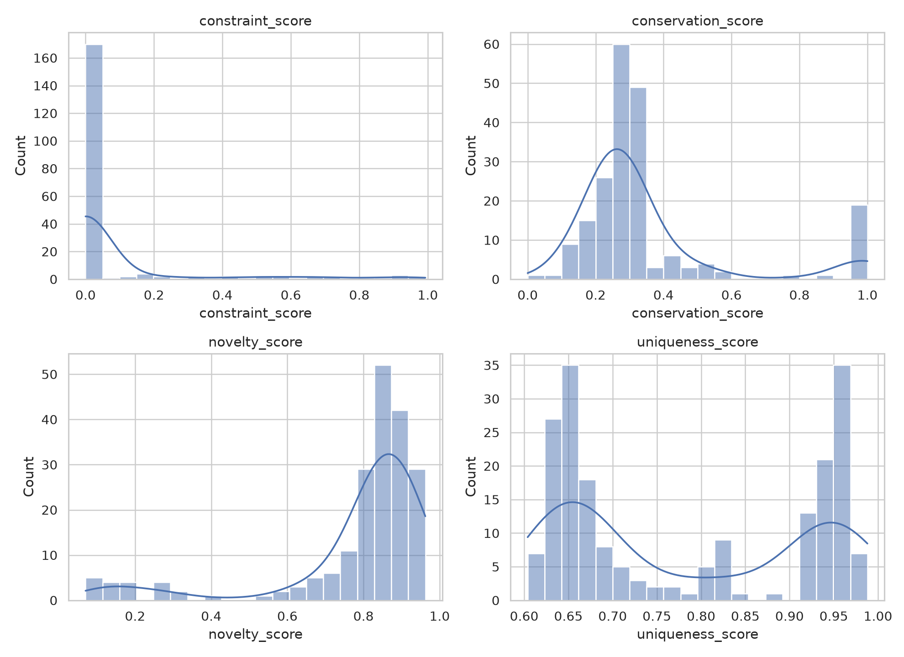
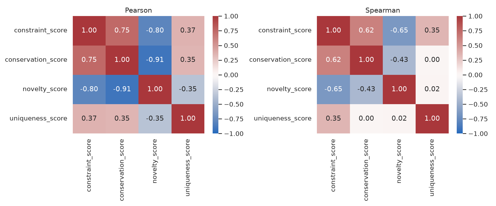
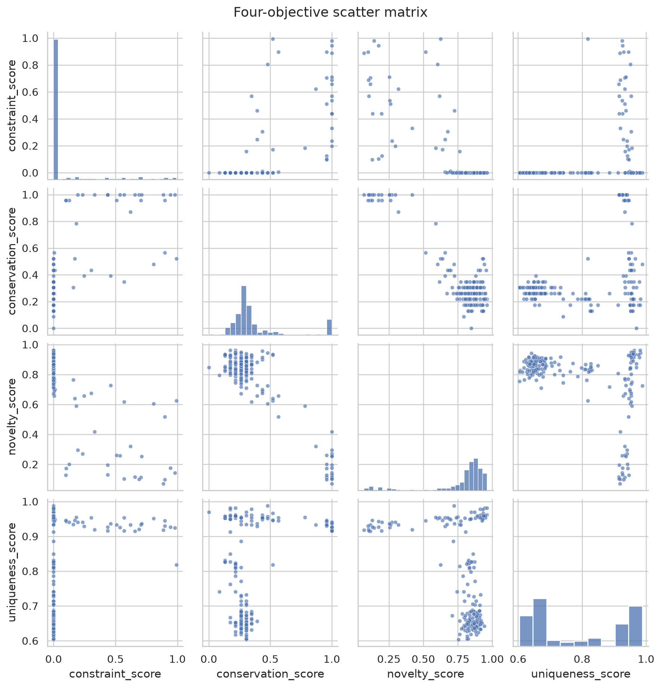

# GvpA 候选序列多目标评价：探索性数据分析

课程：机器学习综合实践　项目：GV02-03　阶段：M2　随机种子：42

## 1 数据与分析口径

本阶段使用 `data/candidates/t05/generated_gvp.fasta` 中的 200 条 T05 生成候选作为唯一待筛选对象。四份名义天然 GvpA 来源经显式标签、完整性、字符和长度规则清洗后，由 3720 条来源记录得到 1224 条不同天然序列；再以 CD-HIT 90% identity 聚类得到 418 条参考代表。天然参考只用于确定保守位点、校准域证据和计算新颖性，不进入候选排名。

参考清洗共排除或标记：30 条 GvpJ、19 条 partial/fragment、32 条无显式 GvpA 标签、1 条含非标准残基；2447 条合格来源记录与已保留序列完全重复。一个记录可以同时触发多个原因，所以原因数不能与排除数直接相加。完整来源到清洗 ID 的映射见 `data/processed/gv02_03/reference_mapping.tsv`。

## 2 四个评价维度

| 维度 | 操作性定义 | 均值 | 中位数 | 范围 |
| --- | --- | ---: | ---: | ---: |
| 约束满足度 | PF00741 域得分相对天然参考的经验百分位，并乘模型覆盖因子 | 0.0774 | 0.0000 | 0–0.9928 |
| 保守性 | 候选在 23 个参考统计保守列上与共识残基相同的比例；缺口计 0 | 0.3474 | 0.2609 | 0–1.0000 |
| 新颖性 | 1 − 候选对最近天然序列的覆盖校正 identity | 0.7813 | 0.8542 | 0.0698–0.9623 |
| 候选级独特性 | 候选到其余 199 条候选的平均覆盖校正距离 | 0.7831 | 0.7205 | 0.6039–0.9880 |

PF00741.24 模型长 39 aa，GA domain cutoff 为 25 bits。418 条聚类参考均有可报告命中；其可信命中的模型覆盖率第 5 百分位经预设上限约束后得到 0.95。200 条候选中 37 条有可报告域命中，27 条同时满足 25 bits 与 0.95 覆盖门槛。这里的“通过”只代表 Gas_vesicle 家族域证据，不能证明 GvpA 功能，也不能替代湿实验。

图 1　200 条候选四维分布。约束满足度的零值较多，说明 T05 的混合 Gvp 生成池并不是纯 GvpA 候选池。

## 3 相关性与冲突结构

| 指标对 | Pearson r | Spearman ρ | 解释 |
| --- | ---: | ---: | --- |
| 约束–保守性 | 0.7498 | 0.6179 | 家族域证据与参考保守列一致性总体同向 |
| 约束–新颖性 | -0.7961 | -0.6518 | 越接近天然家族模式的候选通常越不新颖 |
| 保守性–新颖性 | -0.9127 | -0.4252 | 最强线性冲突；秩相关较弱提示非线性、零值或分组效应 |
| 约束–独特性 | 0.3662 | 0.3460 | 弱到中等正相关，不能视为同一指标 |
| 保守性–独特性 | 0.3481 | 0.0004 | 线性关系弱，几乎没有单调关系 |
| 新颖性–独特性 | -0.3538 | 0.0198 | 两个“差异”概念并不等价：对天然新颖不代表在生成池内独特 |

图 2　Pearson 与 Spearman 相关矩阵。相关性描述当前候选池的共同变化，不构成功能因果证据。

图 3　四维散点矩阵。大量约束分为 0 的候选形成明显边界，因此必须同时报告 Pearson 和 Spearman，不能只靠单一相关系数下结论。

## 4 对 RQ1 的阶段回答

当前数据中最显著的冲突是质量代理（约束、保守性）与新颖性之间的负相关；约束和保守性相互支持，但并非冗余。候选对天然参考的新颖性与候选池内部独特性几乎没有单调关系（ρ=0.0198），因此“新颖性”和“多样性”不能合并成一个指标。后续聚合策略必须显式保留这四个维度，否则会偏向天然相似但不新颖的序列，或偏向远离参考但缺乏家族证据的离群序列。

## 5 局限与下一阶段

- 23 个位点是由参考 MSA 统计定义的保守列，不是实验验证的功能关键位点。
- PF00741 同时覆盖 GvpA/GvpJ 相关家族，域通过只是必要证据之一。
- BLAST 是局部比对；本项目用 `pident × alignment_length / max(query_length,target_length)` 校正未对齐尾部，但它仍不是严格全局 identity。
- 当前没有候选功能真值，不能报告准确率、AUC 或“功能提升”。后续只比较可审计的代理指标、名单重叠和稳定性。

下一阶段在同一评分表和同一预算下实现等权加权、Pareto 非支配排序及各维度轮转三种策略。
