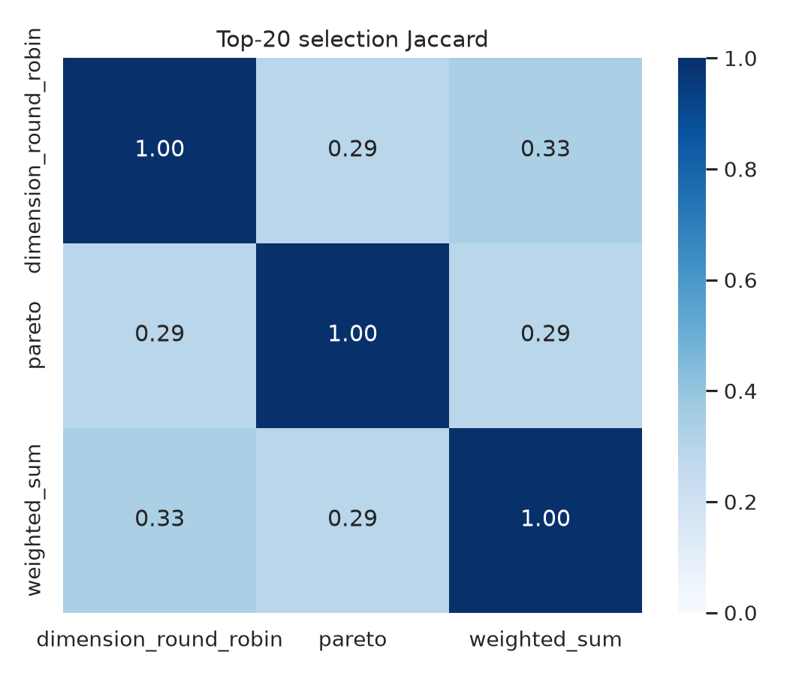

# GvpA 候选序列多目标评价体系与初步筛选

课程：机器学习综合实践　项目：GV02-03　阶段：M3　配置：`configs/gv02_03.yaml`

## 1 可复现评价流水线

统一入口为：

```bash
conda env create -f environment.yml
conda activate ml-gv02-03
python -B experiments/run_full_experiment.py --config configs/gv02_03.yaml
```

流水线依次执行参考集清洗、CD-HIT 去冗余、MAFFT 参考比对、候选添加比对、PF00741/HMMER 扫描、BLAST 候选–参考和候选–候选比对、四维评分、三策略筛选以及统计分析。运行中不覆盖任何原始 FASTA。配置、输入 SHA-256、工具版本、模型版本和关键输出哈希记录于 `results/gv02_03/manifest.json`。

| 组件 | 本次实际版本或资源 | 用途 |
| --- | --- | --- |
| Pfam profile | PF00741.24 / Gas_vesicle，SHA-256 `e44f933c…c2f` | 家族域约束 |
| HMMER | 3.4 | 候选与参考 profile 扫描 |
| CD-HIT | 4.8.1，identity 0.90 | 降低近重复参考对保守列频率的支配 |
| MAFFT | 7.526 | 参考 MSA，并用 `--add --keeplength` 映射候选 |
| BLAST+ | 2.17.0 | 最近天然序列和候选间局部相似性 |
| Python | 3.11.16 | 指标、策略、统计和绘图 |

## 2 指标实现

### 2.1 约束满足度

HMMER 原始扫描采用宽松报告阈值 E=1000，以免在扫描阶段丢失供离线阈值分析使用的低分命中。正式域通过条件由 PF00741.24 自带 GA domain score 25 bits 与参考覆盖分布共同确定，模型覆盖门槛为 0.95。连续约束分是候选 domain bit score 在参考命中得分中的经验百分位，再乘 `min(1, model_coverage/0.95)`。未检出记 0，工具失败则抛错，二者不会混淆。

### 2.2 保守性

仅用 418 条 CD-HIT 代表定义统计保守位点：参考列 gap fraction ≤0.10 且非缺口残基中共识比例 ≥0.90，共得到 23 列。候选不参与位点定义，随后作为新增序列映射到固定参考比对；与共识一致计 1，缺口、未覆盖或不一致计 0。

### 2.3 新颖性

对每个候选取最接近的 1224 条清洗天然参考之一。为避免很短的局部高同一片段造成虚高，定义：

```text
effective_identity = pident × alignment_length / max(query_length, target_length)
novelty = 1 - max_reference(effective_identity)
```

原始 pident、query/target coverage、E-value 和最近参考 ID 均保留在评分表。

### 2.4 多样性

候选级独特性用于四维排序：某候选到其余 199 条候选的平均覆盖校正距离。集合多样性用于评价筛选子集：子集中全部无序序列对距离的均值。二者分开计算，避免把一个集合统计量错误复制给每条序列。

## 3 初步 Top-20 筛选

三种策略使用相同 200 条候选、四维分数和 K=20：

| 策略 | 约束均值 | 保守性均值 | 新颖性均值 | 独特性均值 | 集合多样性 | 域通过率 |
| --- | ---: | ---: | ---: | ---: | ---: | ---: |
| 等权加权 | 0.6626 | 0.8739 | 0.2909 | 0.9241 | 0.6121 | 100% |
| Pareto 排序 | 0.3646 | 0.5804 | 0.5971 | 0.9435 | 0.8753 | 60% |
| 各维度轮转 | 0.3708 | 0.5783 | 0.5893 | 0.9431 | 0.8857 | 50% |


图 1　Top-20 各策略代理质量。不存在所有维度同时占优的策略。

等权加权 Top-20 名单为：`gen_42, gen_161, gen_95, gen_199, gen_194, gen_101, gen_6, gen_56, gen_39, gen_97, gen_92, gen_44, gen_173, gen_123, gen_142, gen_179, gen_109, gen_71, gen_115, gen_67`。20 条均通过域门槛。完整分数、入选依据和 FASTA 见 `results/gv02_03/selections/`。

三种 Top-20 的两两交集为 9、10、9 条，对应 Jaccard 0.2903、0.3333、0.2903。这说明聚合规则不是形式差异，而是会实质改变约一半以上的最终名单。



图 2　Top-20 名单 Jaccard。对角线为 1。

## 4 初步结论与质量边界

等权加权适合把 PF00741/保守性证据置于较高优先级的质量筛选；Pareto 和轮转适合偏探索的候选组合，保留更高新颖性与集合多样性，但包含更多域不通过候选。任何名单都只是计算优先级，不是已验证的 GvpA 功能序列。最终应将场景偏好、原始证据和阈值一并交给下游，而不只交一个总分。
