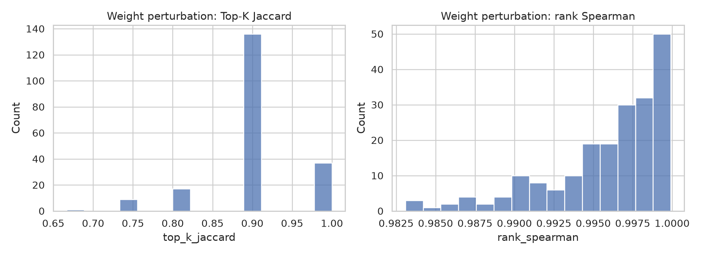
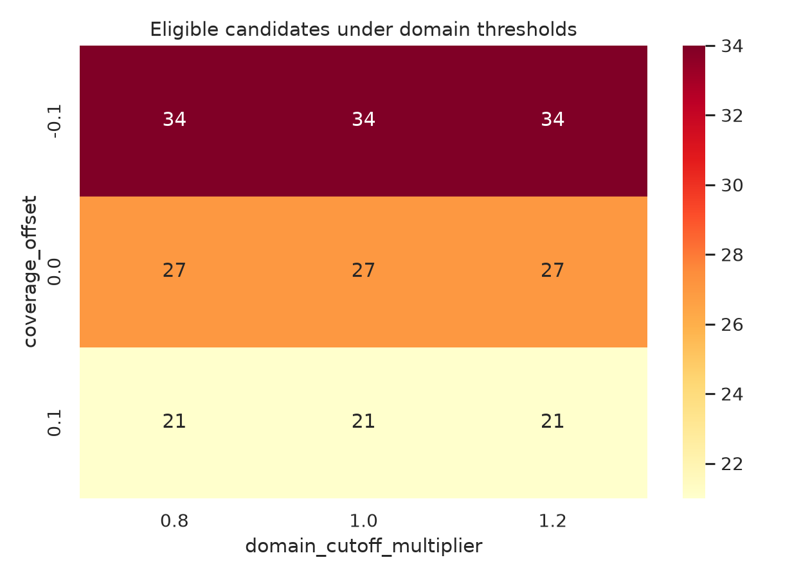

# GvpA 候选序列多目标筛选：完整实验与鲁棒性分析

课程：机器学习综合实践　项目：GV02-03　阶段：M4　主预算：K=20

## 1 三种策略及预算敏感性

实验比较等权加权、Pareto 非支配层+拥挤距离、各维度 Top-k 轮转三种策略；所有策略共享候选池、评分表、并列规则和预算。除主预算 K=20 外，还运行 K=10 与 K=50，避免只围绕一个名单下结论。

| K | 策略 | 约束 | 保守性 | 新颖性 | 独特性 | 集合多样性 | 域通过率 |
| ---: | --- | ---: | ---: | ---: | ---: | ---: | ---: |
| 10 | 等权加权 | 0.8273 | 0.8391 | 0.3061 | 0.9209 | 0.6557 | 100% |
| 10 | Pareto | 0.4632 | 0.6565 | 0.5467 | 0.9370 | 0.8629 | 70% |
| 10 | 轮转 | 0.4342 | 0.6609 | 0.5265 | 0.9334 | 0.8318 | 60% |
| 20 | 等权加权 | 0.6626 | 0.8739 | 0.2909 | 0.9241 | 0.6121 | 100% |
| 20 | Pareto | 0.3646 | 0.5804 | 0.5971 | 0.9435 | 0.8753 | 60% |
| 20 | 轮转 | 0.3708 | 0.5783 | 0.5893 | 0.9431 | 0.8857 | 50% |
| 50 | 等权加权 | 0.3092 | 0.6287 | 0.5687 | 0.9428 | 0.8653 | 54% |
| 50 | Pareto | 0.3097 | 0.6261 | 0.5530 | 0.9433 | 0.8620 | 54% |
| 50 | 轮转 | 0.2940 | 0.5748 | 0.5954 | 0.9397 | 0.8859 | 50% |

K 较小时，策略偏好最突出；K=50 时三者逐渐接近。等权策略在 K=20 获得最高质量代理，轮转获得最高集合多样性，Pareto 在二者之间形成较平衡的探索集合。

## 2 Pareto 前沿（选做实验 6）

四目标第一非支配层含 35/200 条候选。前沿并不等于“全部合格”：例如长度 512 的 `gen_167` 约束分为 0，但新颖性 0.9609、独特性 0.9812，仍可因探索维度优势进入前沿。相反，`gen_101` 的约束 0.8971、保守性 0.9565，但新颖性只有 0.0986。该例说明非支配的含义是“没有另一个候选在所有目标上都不差且至少一个更好”，不是功能保证。

因此，Pareto 前沿适合展示取舍并构造探索候选库；若下游要求气囊蛋白家族证据，仍需增加明确的域门槛或人工复核。

## 3 消融实验

以等权 Top-20 为完整模型，逐个移除一个维度并对其余权重重新归一化：

| 变体 | 与完整名单 Jaccard | 约束 | 保守性 | 新颖性 | 独特性 |
| --- | ---: | ---: | ---: | ---: | ---: |
| 四维完整 | 1.0000 | 0.6626 | 0.8739 | 0.2909 | 0.9241 |
| 去约束 | 0.1429 | 0.1352 | 0.6109 | 0.6981 | 0.9516 |
| 去保守性 | 0.2121 | 0.3425 | 0.4130 | 0.7316 | 0.9477 |
| 去新颖性 | 0.8182 | 0.6520 | 0.9152 | 0.2535 | 0.9235 |
| 去独特性 | 1.0000 | 0.6626 | 0.8739 | 0.2909 | 0.9241 |

约束维度对当前名单影响最大：移除后 Jaccard 仅 0.1429，约束均值降到 0.1352。保守性也不可替代，移除后名单 Jaccard 为 0.2121。新颖性对名单的作用小于前两者，但移除会让新颖性从 0.2909 降到 0.2535。独特性消融没有改变当前等权 Top-20（Jaccard 1.0000），但这不意味着集合多样性不重要；独特性与最终集合两两距离是不同统计量，而且在其他预算/策略中仍参与决策。

## 4 权重鲁棒性

在等权 0.25 周围，对四个权重分别做独立均匀 ±20% 相对扰动后重新归一化，共 200 次，随机种子 42。Top-20 Jaccard 均值为 0.9064，最小 0.6667；完整排名 Spearman 均值 0.9959，最小 0.9831。

图 1　权重扰动下名单和完整排名稳定性。基准附近整体排名稳定，但最差扰动仍替换了 Top-20 中的一部分边界候选。

该结论只适用于基准附近的±20%局部扰动，不能外推到“质量优先”与“探索优先”等大幅偏好改变。

## 5 域阈值鲁棒性

以 GA=25 bits、模型覆盖 0.95 为基准，扫描 bit-score 倍率 0.8/1.0/1.2 和覆盖偏移 -0.10/0/+0.10。当前候选命中的 bit score 分布使 20–30 bits 三个 cutoff 下的可选数量不变；覆盖门槛 0.85、0.95、1.00 分别产生 34、27、21 个合格候选。前两个门槛的质量门控 Top-20 与基准相同，覆盖 1.00 时 Jaccard 为 0.8182。

图 2　域阈值组合下的合格候选数。当前数据对覆盖门槛比对 20–30 bits 的得分 cutoff 更敏感。

## 6 随机筛选对比（选做实验 7）

从 200 条候选中无放回随机抽取 20 条，共 1000 次。随机集合均值为：约束 0.0763、保守性 0.3446、新颖性 0.7831、独特性 0.7824、集合多样性 0.7821、域通过率 13.29%。

- 三种策略的约束、保守性、独特性和域通过率均显著高于随机分布；经验单侧 p 多为 0.001–0.002。
- 等权策略的集合多样性 0.6121 低于随机均值，99.1% 的随机集合不低于它；这是质量优先带来的趋同代价。
- Pareto 与轮转的集合多样性分别为 0.8753 和 0.8857，超过随机 95th percentile 0.8672；经验 p 分别为 0.0350 和 0.0220。
- 三种策略的新颖性均低于随机集合。原因不是算法失败，而是天然距离较远的候选往往缺乏约束/保守性，多目标筛选主动牺牲了一部分新颖性。

多目标策略并非在所有维度上击败随机选择；其价值是按照明确下游偏好改变质量组合。

## 7 对 RQ2、RQ3 的回答

RQ2：若下游验证昂贵且优先保证家族/保守证据，应使用带明确阈值的加权策略；若希望用相同预算覆盖多种取舍，使用 Pareto；若要求四个单项高分区域都获得候选，轮转策略最直观。本实验不支持宣称某一种策略全局最优。

RQ3：等权策略对局部权重变化较稳定，但对是否包含约束、保守性维度高度敏感；域门槛在本数据中主要受覆盖要求影响。生产或湿实验前应同时发布名单、原始四维证据与阈值版本，避免只冻结一个不透明综合分。
