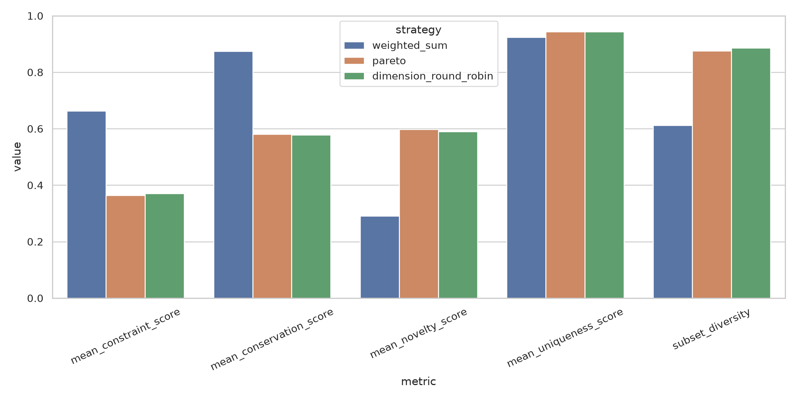

# GvpA 候选序列的多目标评价与筛选

机器学习综合实践　GV02-03 最终报告

## 摘要

本项目面向 200 条已有蛋白质生成候选，构建约束满足度、统计保守性、相对天然参考的新颖性和候选池内多样性四维评价体系，不训练新的生成模型。我们从 3720 条名义 GvpA 来源记录中构建 1224 条可追溯天然参考，并以 90% identity 聚类得到 418 条参考代表；采用 PF00741.24/HMMER、MAFFT 与 BLAST+ 产生真实序列证据。200 条候选中 37 条有 PF00741 可报告命中，27 条达到 GA 25 bits 与模型覆盖 0.95 的联合门槛。

相关性分析表明约束–保守性正相关（Pearson 0.7498），质量代理与新颖性强烈冲突（约束–新颖性 -0.7961，保守性–新颖性 -0.9127）。在 Top-20 中，等权加权策略获得最高约束/保守性和 100% 域通过率；Pareto 与各维度轮转则将集合多样性提高到 0.8753/0.8857。200 次±20%权重扰动的名单 Jaccard 均值为 0.9064，说明等权基准局部稳定；逐维消融显示约束与保守性是当前选择中影响最大的维度。结果支持按下游场景选择聚合策略，而不支持单一“全局最优”方法。所有输入哈希、参数、工具版本、逐条证据、名单和测试均可审计。

关键词：GvpA；蛋白质序列；多目标优化；HMMER；Pareto；鲁棒性

<!-- pagebreak -->

## 1 问题与研究问题

生成模型可以快速产生大量序列，但候选是否值得昂贵的结构或湿实验验证，需要在多个冲突目标间决策。本项目接收已有 T05 候选，只实现评价和筛选系统：

- RQ1：约束满足度、保守性、新颖性与多样性如何相关和冲突？
- RQ2：加权、Pareto 与各维度 Top-k 策略如何改变最终名单，各自适合何种场景？
- RQ3：权重和阈值微调是否导致名单显著改变？

本项目没有候选功能真值。全文的“分数”“通过”和“优于随机”均指预注册的计算代理，不代表功能准确率、结构稳定性或气囊组装成功率。

## 2 数据

唯一候选入口是 `data/candidates/t05/generated_gvp.fasta`，含 200 条不同序列，长度 66–512 aa，中位数 103 aa；全部由标准 20 种氨基酸组成。候选来自 T05 混合 Gvp 数据训练的生成模型，只有 `gen_*` 编号，无可靠亚家族和功能标签。

天然参考来自四份仓库内 FASTA。我们要求头信息显式标注 GvpA，排除 GvpJ、partial/fragment/predicted、非标准残基及长度不在 50–180 aa 的记录，并按完整序列精确去重。3720 条来源记录得到 1224 条不同参考。清洗结果再用 CD-HIT 0.90 降冗余到 418 条，用于 MSA 与参考分布校准；新颖性比对仍使用全部 1224 条清洗参考，避免丢失最近天然邻居。

`data/raw/t05/real_gvp.fasta` 是多家族混合背景，未作为纯 GvpA 参考。原任务材料提到的 PF01132 实为 EFP 相关域；本实验使用官方 InterPro/Pfam 提供的 PF00741.24 Gas_vesicle profile。PF00741 也覆盖 GvpJ 相关蛋白，因此命中只能作为家族域证据。

<!-- pagebreak -->

## 3 方法

### 3.1 参考与保守位点

CD-HIT 代表经 MAFFT 比对。只在参考 MSA 中选取 gap fraction ≤0.10 且共识比例 ≥0.90 的列，共 23 个。候选用 MAFFT `--add --keeplength` 加入固定参考比对；候选不参与保守位点定义。保守分等于候选在 23 列上与共识一致的比例，缺口和未覆盖计 0。

### 3.2 四维分数

约束分使用 HMMER domain bit score 的参考经验百分位，并乘以模型覆盖因子。正式域通过要求 PF00741.24 自带 GA domain score ≥25 bits、模型覆盖 ≥0.95。新颖性使用 `1 - max effective_identity`，其中 `effective_identity = pident × alignment_length / max(两条序列长度)`，避免短局部命中被当作整条同源。候选级独特性是候选到其他 199 条候选的平均有效距离；筛选子集另计算平均两两距离作为集合多样性。

四个归一化分数都在 [0,1] 且越大越好。无 HMM 命中为有效的 0 分；外部程序失败会终止流水线，不会伪造分数或静默跳过。

### 3.3 聚合策略

1. 等权加权：四维权重各 0.25，按综合分降序。
2. Pareto：按非支配层升序，再用拥挤距离保留同一层的目标空间覆盖；稳定 ID 处理最终并列。
3. 各维度轮转：依次从约束、保守、新颖、独特性各自排序中加入尚未入选候选，直到预算用完。

三者在完全相同的 200 条候选和 K=10/20/50 下比较。主预算为 K=20。评价使用四维均值、域通过率、集合多样性、名单 Jaccard 和 Pareto 层，而不是拿某策略自身的综合分证明自身更好。

### 3.4 消融、鲁棒性与随机基线

消融逐个移除四维之一，其余等权重新归一化。权重鲁棒性在 0.25 附近进行 200 次独立±20%相对扰动；阈值鲁棒性组合 0.8/1.0/1.2 倍 domain score cutoff 与 -0.10/0/+0.10 模型覆盖偏移。随机基线从 200 条候选中无放回抽取 20 条，共 1000 次。所有随机实验种子固定为 42。

<!-- pagebreak -->

## 4 结果

### 4.1 单候选分布和 RQ1

| 指标 | 均值 | 中位数 | 最小 | 最大 |
| --- | ---: | ---: | ---: | ---: |
| 约束 | 0.0774 | 0.0000 | 0.0000 | 0.9928 |
| 保守性 | 0.3474 | 0.2609 | 0.0000 | 1.0000 |
| 新颖性 | 0.7813 | 0.8542 | 0.0698 | 0.9623 |
| 独特性 | 0.7831 | 0.7205 | 0.6039 | 0.9880 |

约束与保守性同向，而两者都与新颖性冲突。保守–新颖 Pearson -0.9127 是绝对值最大的线性相关；对应 Spearman -0.4252，结合散点可见零约束候选和不同序列组造成非线性结构。新颖性–独特性 Spearman 0.0198，接近无单调关系，证明“远离天然库”和“在生成池中不同”必须分别评价。

### 4.2 策略比较和 RQ2

| Top-20 策略 | 约束 | 保守性 | 新颖性 | 独特性 | 集合多样性 | 域通过 |
| --- | ---: | ---: | ---: | ---: | ---: | ---: |
| 等权加权 | **0.6626** | **0.8739** | 0.2909 | 0.9241 | 0.6121 | **100%** |
| Pareto | 0.3646 | **0.5804** | **0.5971** | **0.9435** | 0.8753 | 60% |
| 轮转 | **0.3708** | 0.5783 | 0.5893 | 0.9431 | **0.8857** | 50% |

等权策略明显偏向家族与保守证据；Pareto/轮转牺牲一部分该证据换取探索性。Top-20 两两 Jaccard 仅 0.2903–0.3333。第一 Pareto 前沿有 35 条，内部同时包含强域证据候选和高新颖但域不通过的长序列，必须结合场景解释。

场景建议如下：

- 验证预算很小、实验失败成本高：先设域/长度等硬门槛，再用可解释权重排序。
- 希望探索多种目标取舍：使用 Pareto 名单，并对每条保留其非支配原因和原始证据。
- 需要保证每个单项优势区域都有代表：使用轮转策略，但不应把单项极值自动视为功能合格。

### 4.3 消融和 RQ3

移除约束后的 Top-20 与完整名单 Jaccard 仅 0.1429，约束均值从 0.6626 降至 0.1352；移除保守性 Jaccard 为 0.2121。移除新颖性和独特性的 Jaccard 分别为 0.8182、1.0000。当前等权名单主要由约束与保守性塑造，但新颖性仍负责避免进一步向天然模板集中；独特性在这个特定预算下未改变名单，不代表它在其他策略或预算中无效。

200 次局部权重扰动下 Top-20 Jaccard 均值 0.9064、最小 0.6667，完整排名 Spearman 均值 0.9959、最小 0.9831。阈值实验中 score cutoff 20–30 bits 未改变可选数量，覆盖门槛 0.85/0.95/1.00 分别留下 34/27/21 条；覆盖 1.00 时门控 Top-20 相对基准 Jaccard 0.8182。因此基准对小权重变化稳定，但最终可验证池对模型覆盖门槛仍敏感。

### 4.4 随机基线

随机 Top-20 的集合多样性均值为 0.7821。等权策略的 0.6121 低于它，而 Pareto 0.8753 与轮转 0.8857 超过随机 95th percentile 0.8672。三种策略都显著提高约束、保守性、独特性和域通过率，但新颖性均低于随机。这个结果直接体现多目标冲突：筛选的目的不是让所有均值都比随机高，而是在可解释偏好下形成更合适的质量组合。

<!-- pagebreak -->

## 5 工程实现与验证

代码按数据读写、外部工具、指标、选择策略、分析和流水线分层。`configs/gv02_03.yaml` 冻结全部关键参数；`environment.yml` 提供独立环境；`results/gv02_03/manifest.json` 记录输入/输出 SHA-256、PF00741 版本与工具版本。16 项自动化测试覆盖 FASTA I/O、坏输入拒绝、HMMER/BLAST 解析、局部 identity 覆盖校正、保守位点、距离矩阵、参考清洗、Pareto、三种确定性选择行为和结果完整性，当前全部通过。

关键产物包括逐候选证据表、距离矩阵、三策略 K=10/20/50 的 TSV 与 FASTA、相关矩阵、消融、权重/阈值鲁棒性、1000 次随机基线、图件及机器可读汇总。相同输入、环境、配置和随机种子可重新生成这些结果。

## 6 局限、风险与后续验证

第一，候选来自混合 Gvp 生成模型，多数没有 PF00741 命中；这不是评价脚本失败，而是输入池与目标家族不完全一致。第二，PF00741 非 GvpA 专一，23 个位点也是统计保守而非实验功能位点。第三，BLAST 覆盖校正是工程上可解释的近似，严格全局比对或结构相似性可作为后续复核。第四，四维之间共享序列相似性信息，不能将相关性理解为独立因果证据。第五，没有湿实验真值，所以不能用本实验声称候选可形成气囊。

下游建议优先复核等权 Top-20（20 条均通过当前域门槛），排查长度、跨膜/低复杂度、结构可行性和 GvpA/GvpJ 区分；同时从 Pareto/轮转中各保留少量高多样候选作为探索组。最终应由独立结构预测、表达/组装实验和安全审查验证，而不是继续调权重直到得到“好看”结果。

## 7 结论

本项目完成了从原始生成池到可审计筛选名单的完整链条。RQ1 的答案是质量代理与新颖性存在强冲突，新颖性和池内独特性并不等价；RQ2 的答案是加权适合质量优先，Pareto 适合保留取舍，轮转适合覆盖各单项优势；RQ3 的答案是等权基准对局部权重变化较稳定，但维度删除和覆盖门槛会显著改变名单。因而合理交付不是一个被称为“最佳”的总分，而是带版本、原始证据、场景偏好和稳定性说明的候选集合。

## 参考资料

1. 课程项目池，GV02-03 多目标候选评价，第 20–22 页。
2. EMBL-EBI InterPro. PF00741 / Gas_vesicle family and downloadable HMM annotation. https://www.ebi.ac.uk/interpro/entry/pfam/PF00741/
3. Eddy SR. Accelerated Profile HMM Searches. PLoS Computational Biology, 2011, 7(10):e1002195.
4. Katoh K, Standley DM. MAFFT multiple sequence alignment software version 7. Molecular Biology and Evolution, 2013, 30(4):772–780.
5. Altschul SF et al. Basic local alignment search tool. Journal of Molecular Biology, 1990, 215(3):403–410.
6. Li W, Godzik A. Cd-hit: a fast program for clustering and comparing large sets of protein or nucleotide sequences. Bioinformatics, 2006, 22(13):1658–1659.
