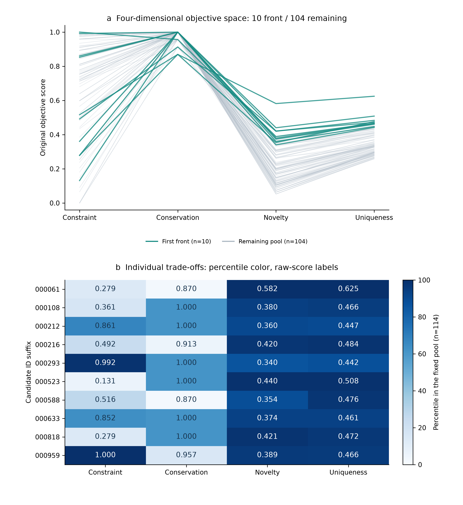
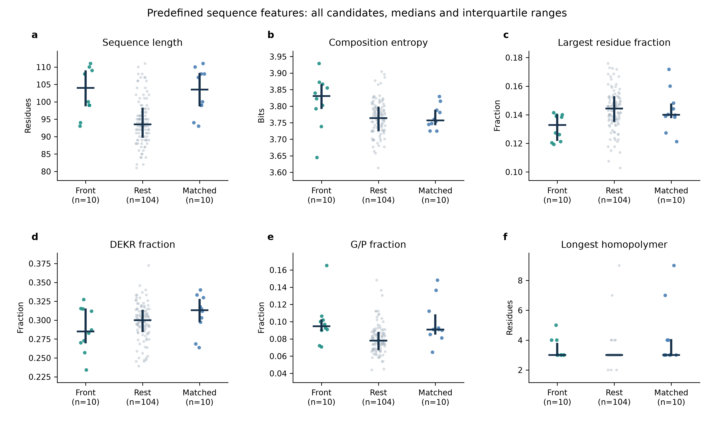
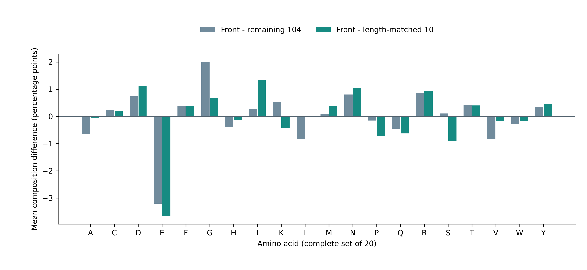

# 选做实验 6：Pareto 前沿的目标取舍与序列特征

## 1. 实验问题与完成范围

本实验回答：四维非支配前沿中的候选分别在哪些维度突出；这些候选是否具有相似的序列特征。与实验 7 随机筛选对照共同构成两项选做，实验 5 下游性质预测未做。

当前固定排名池共有 114 条序列，第一前沿 10 条，其余 104 条。四维定义、资格门槛和原始评分均保持不变。本实验从发布清单核验后的分数与 FASTA 计算特征，不重新训练生成器。

## 2. 分析方案

分析前固定六项序列描述：长度、组成 Shannon 熵、最高单一残基比例、DEKR 比例、G/P 比例和最长同聚物段，并完整报告 20 种标准氨基酸组成。DEKR 为明确残基集合的计数比例，不是实际净电荷预测。

主比较为前沿 10 条与非前沿 104 条。敏感性对照使用最小总绝对长度差的一对一匹配，为 10 条前沿选取 10 条不同的非前沿候选。匹配目标仅包含长度，输入按 ID 排序；有多个等价最优解时使用固定软件环境得到的解，不把该解描述为唯一科学选择。实现使用 SciPy 的 [linear_sum_assignment](https://docs.scipy.org/doc/scipy/reference/generated/scipy.optimize.linear_sum_assignment.html)。

组间给出均值、中位数、四分位数、范围及效应量。Cliff delta 为 P(前沿值大于对照) 减去 P(前沿值小于对照)。配对分析另保留每对的特征差值；这些特征没有统一的“越高越好”方向。所有比较为描述性分析，不计算 p 值，不进行功能或因果推断。

## 3. 前沿成员在哪些目标上突出？



上图每条线是一条候选在四个原始目标上的得分，灰色为 104 条非前沿，绿色为四维第一前沿的 10 条；轴之间的连线只帮助阅读四维取舍。下图颜色表示各维度在同一 114 条候选池中的平均并列排名百分位；单元格为原始分数。百分位是相对位置，不是功能概率。最强/最弱维度按各维百分位比较，完整并列结果均保留。

| 候选 ID | 约束满足度 | 保守性 | 新颖性 | 候选独特性 | 最高百分位维度 | 最低百分位维度 |
| --- | --- | --- | --- | --- | --- | --- |
| vae_candidate_000061 | 0.2787 | 0.8696 | 0.5818 | 0.6248 | 新颖性、候选独特性 | 保守性 |
| vae_candidate_000108 | 0.3607 | 1.0000 | 0.3796 | 0.4656 | 候选独特性 | 约束满足度 |
| vae_candidate_000212 | 0.8607 | 1.0000 | 0.3604 | 0.4475 | 新颖性 | 保守性 |
| vae_candidate_000216 | 0.4918 | 0.9130 | 0.4200 | 0.4836 | 候选独特性 | 保守性 |
| vae_candidate_000293 | 0.9918 | 1.0000 | 0.3404 | 0.4424 | 约束满足度 | 保守性 |
| vae_candidate_000523 | 0.1311 | 1.0000 | 0.4404 | 0.5085 | 新颖性、候选独特性 | 约束满足度 |
| vae_candidate_000588 | 0.5164 | 0.8696 | 0.3535 | 0.4764 | 候选独特性 | 保守性 |
| vae_candidate_000633 | 0.8525 | 1.0000 | 0.3737 | 0.4608 | 新颖性、候选独特性 | 保守性 |
| vae_candidate_000818 | 0.2787 | 1.0000 | 0.4211 | 0.4717 | 新颖性 | 约束满足度 |
| vae_candidate_000959 | 1.0000 | 0.9565 | 0.3889 | 0.4658 | 约束满足度 | 保守性 |

三个例子说明前沿不存在统一的最优序列：

- `vae_candidate_000959` 的约束分为 1.0000，保守性为 0.9565，体现较强的域约束支持。
- `vae_candidate_000061` 的新颖性为 0.5818、独特性为 0.6248，但约束分只有 0.2787、保守性为 0.8696，体现探索与约束之间的取舍。
- `vae_candidate_000293` 同时具有 0.9918 的约束分和 1.0000 的保守性；其新颖性为 0.3404，低于上述探索端候选。

“最低百分位维度”只表示该候选各维相对排名中较低的一项，不表示不合格或生物学缺陷。例如保守性为 1 的候选仍可能因大量满分并列而在这列呈现较低百分位。

前沿按四个目标共同定义，不能把某个二维投影中的高点当成新的四维前沿。目标得分突出是前沿筛选规则的直接结果，不算独立验证。逐条可靠配对比例、预警与复核标记保存在 [front_details.tsv](front_details.tsv)。

## 4. 是否共享序列特征？



图中每点是一条候选，竖线为四分位距，横线为中位数；随机横向抖动只用于分开重叠点。匹配组是完整非前沿组的子集，不是第三组独立重复。以下均值差的方向统一为前沿减对照，完整分布摘要见 [group_comparison.tsv](group_comparison.tsv)。

| 特征 | 前沿中位数 | 非前沿中位数 | 均值差 | Cliff delta | 匹配后均值差 |
| --- | --- | --- | --- | --- | --- |
| 长度 | 104.0000 | 93.5000 | 8.7731 | 0.6567 | 0.2000 |
| 组成熵（bits） | 3.8309 | 3.7641 | 0.0514 | 0.5000 | 0.0494 |
| 最高单一残基比例 | 0.1328 | 0.1443 | -0.0120 | -0.5413 | -0.0117 |
| DEKR 比例 | 0.2849 | 0.3000 | -0.0108 | -0.1923 | -0.0207 |
| G/P 比例 | 0.0947 | 0.0781 | 0.0185 | 0.5288 | -0.0005 |
| 最长同聚物段 | 3.0000 | 3.0000 | 0.2942 | 0.2606 | -0.8000 |

具体结果回答如下：

1. **前沿序列整体偏长，但前沿内仍有差异。**长度均值为 103.1，其余候选为 94.33；前沿范围为 93–111 个残基。长度匹配后的均值差降至 0.2 个残基。
2. **组成更分散的描述在这一长度匹配对照中仍保留。**组成熵均值差由 +0.05141 变为 +0.04938 bits；最高单一残基比例差由 -1.199 变为 -1.170 个百分点。它们描述整体组成分布，不能解释为功能更优。
3. **G/P 与同聚物差异依赖对照选择。**G/P 比例均值差由 +1.854 变为 -0.053 个百分点；最长同聚物段均值差由 +0.294 变为 -0.800 个残基，且两大组的中位数均为 3。不能把这两项表述为前沿共有的稳定优势。
4. **带电残基集合比例略低。**DEKR 比例均值差为 -1.081 个百分点，长度匹配后为 -2.073 个百分点。该组成描述不等于净电荷、可溶性或结构预测。

综上，当前前沿表现为不同目标取舍的序列集合；可观察到组成分散程度的组间差异，但没有证据把某一个组成特征称为全部前沿共享的功能机制。



| 残基 | 前沿均值 | 非前沿均值 | 主比较差（百分点） | 长度匹配差（百分点） |
| --- | --- | --- | --- | --- |
| A | 0.1037 | 0.1103 | -0.658 | -0.044 |
| C | 0.0038 | 0.0014 | 0.245 | 0.202 |
| D | 0.0803 | 0.0729 | 0.739 | 1.123 |
| E | 0.0975 | 0.1296 | -3.212 | -3.676 |
| F | 0.0166 | 0.0128 | 0.385 | 0.378 |
| G | 0.0614 | 0.0413 | 2.009 | 0.673 |
| H | 0.0075 | 0.0113 | -0.380 | -0.128 |
| I | 0.0729 | 0.0703 | 0.263 | 1.335 |
| K | 0.0369 | 0.0316 | 0.533 | -0.443 |
| L | 0.0804 | 0.0889 | -0.846 | -0.033 |
| M | 0.0144 | 0.0135 | 0.096 | 0.373 |
| N | 0.0115 | 0.0035 | 0.804 | 1.051 |
| P | 0.0373 | 0.0388 | -0.155 | -0.726 |
| Q | 0.0250 | 0.0295 | -0.451 | -0.624 |
| R | 0.0725 | 0.0639 | 0.859 | 0.924 |
| S | 0.0909 | 0.0898 | 0.108 | -0.909 |
| T | 0.0475 | 0.0433 | 0.417 | 0.404 |
| V | 0.1174 | 0.1258 | -0.837 | -0.173 |
| W | 0.0070 | 0.0097 | -0.272 | -0.169 |
| Y | 0.0154 | 0.0119 | 0.353 | 0.464 |

上述 20 种残基全部报告，不能只根据最大差异挑出一个残基并称其为决定功能的机制。只有 10 条前沿，且候选共享同一个生成来源；共有长度或组成范围可能来自训练分布及既有筛选门槛，不等于前沿特异的功能模式。

## 5. 长度匹配敏感性与证据覆盖

完成 10 对不同候选的一对一匹配。绝对长度差总和为 2 个残基，中位数为 0.0，最大为 1。逐对对应关系见 [matched_pairs.tsv](matched_pairs.tsv)，逐对特征差见 [matched_feature_differences.tsv](matched_feature_differences.tsv)。匹配只降低长度差异，不消除其他组成、同源或缺失距离偏差。

### 等价最优匹配是否改变解释？

首次比较后发现，长度代价相同的最优解可能不唯一，因此补充固定 seed=42 的 100 次次级代价扰动。代价为“绝对长度差 × (前沿数+1) + [0,1) 随机数”，每次重新求全局一对一最优解，并断言原始总长度差仍为 2。主目标的一单位差大于全部次级成本之和，因而不会用更差的长度匹配换取某个特征方向。

得到 100 种配对、94 种对照集合。该检查是事后补充的等价对照选择敏感性分析，不是 Bootstrap、显著性检验或 100 次独立生物学重复，也没有穷举全部最优解。以下差值全部为前沿减对照，比例特征保持 0–1 单位：

| 特征 | 100 解差值最小值 | 中位数 | 最大值 | 负 / 零 / 正次数 |
| --- | --- | --- | --- | --- |
| 长度 | 0.20000 | 0.20000 | 0.20000 | 0 / 0 / 100 |
| 组成熵（bits） | 0.02156 | 0.04462 | 0.06675 | 0 / 0 / 100 |
| 最高单一残基比例 | -0.01694 | -0.01137 | -0.00367 | 100 / 0 / 0 |
| DEKR 比例 | -0.02778 | -0.01693 | -0.00480 | 100 / 0 / 0 |
| G/P 比例 | -0.00269 | -0.00060 | 0.00261 | 60 / 0 / 40 |
| 最长同聚物段 | -0.90000 | -0.80000 | -0.80000 | 100 / 0 / 0 |

组成熵差在这 100 个解中均为正，范围为 0.02156–0.06675 bits；最高单一残基比例差均为负。G/P 差值 60 次为负、40 次为正，进一步说明它不是本次比较中方向稳定的前沿特征。原始主比较与匹配比较方向不同的结果全部保留，不能选择有利的一种解作结论。

全部匹配解见 [tie_match_pairs.tsv](tie_match_pairs.tsv)，全部特征差见 [tie_match_differences.tsv](tie_match_differences.tsv)。匹配不代表随机分组，也不证明长度是因果解释。

前沿仍有 2/10 条带人工复核标记。逐候选可靠配对比例均值为 70.74%，其余候选为 81.51%，长度匹配对照为 77.56%。这里统计的是到原 136 条合格池的逐候选覆盖，不能混同入选子集内部的配对覆盖。前沿的探索性伴随更少的可解析距离证据，仍需保留复核。

完整摘要见 [summary.json](summary.json)；全部 13 层的描述见 [layer_summary.tsv](layer_summary.tsv)。距离未解析仍保留缺失状态，没有转成最大距离来奖励候选。

## 6. 复现与结论边界

```bash
python experiments/run_pareto_analysis.py --output results/reproductions/pareto_analysis
```

输出目录必须为新的或空目录。原 44 个评价结果不改变；新产物由独立清单记录。原始参考仍为暂定版本，当前只有一个生成批次，原生成权重未交付。本分析完成课程要求中的前沿目标解释与序列特征分析，不是下游性质预测或真实生物学功能验证。

源评价清单 SHA-256：`abd4e0626f44bddf421333b16d1f795df7c8f49e16f9075a9c020686155da22c`。表和图由同一脚本生成，实际数值以 TSV 为准。
